# windbg使用实验

+ Windbg是在windows平台下，强大的用户态和内核态调试工具。相比较于Visual Studio，它是一个轻量级的调试工具
+ 安装winfbg，并查看其版本，最好与可执行程序版本一致

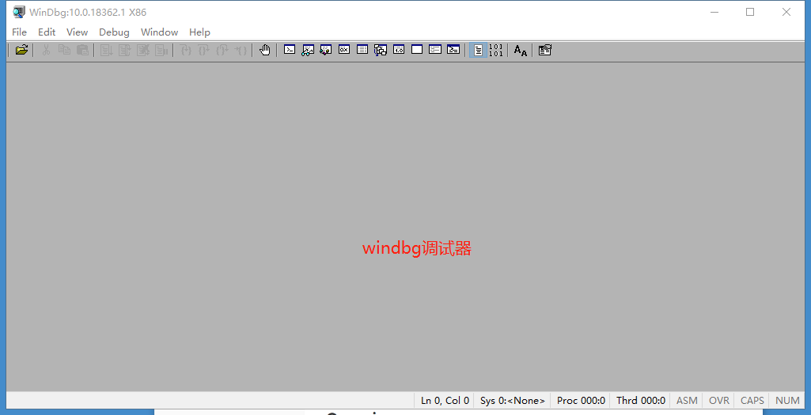

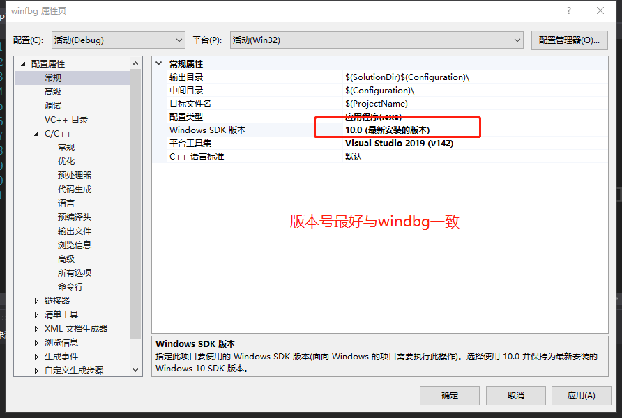

+ 在vs中写代码时，选择多线程调试（MTD模式）

  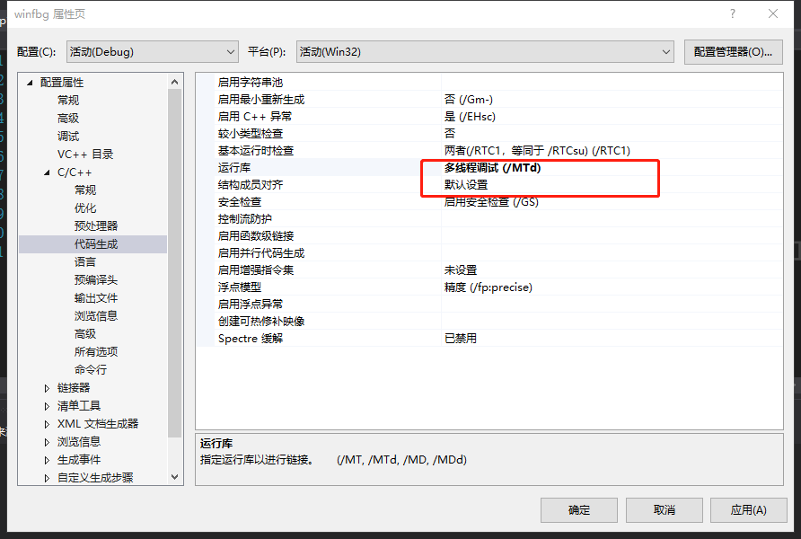

+ 在windbg中打开.exe

  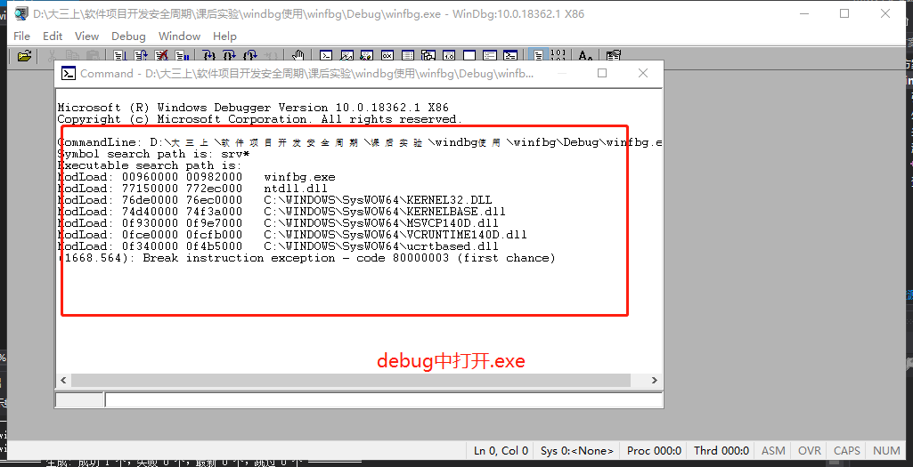

+ 拖进路径（在symbol file path和source file path中添加路径）

  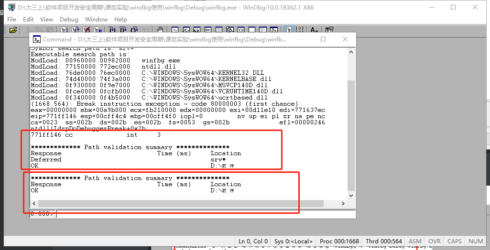

+ 则代码可以开始调试

  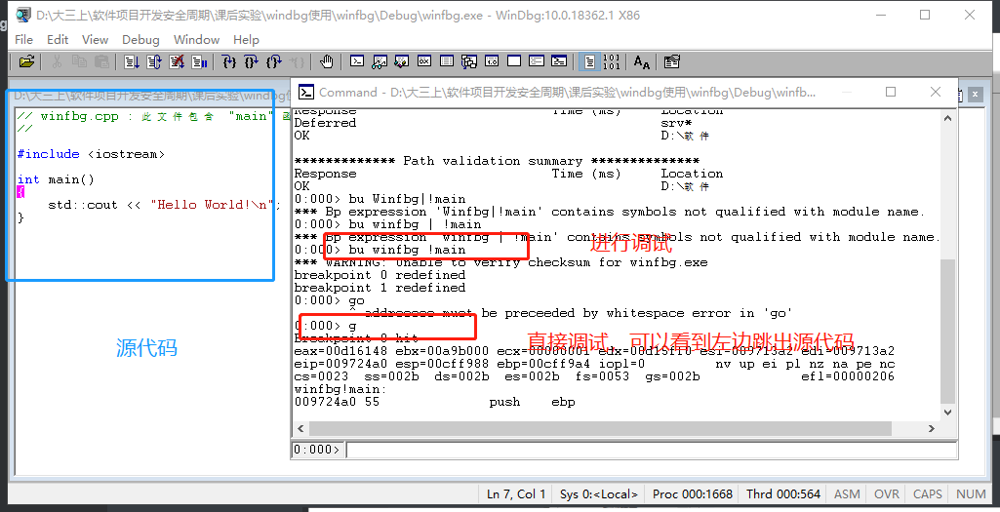

+ 使用windbg调试计算器，跑64位windbg，打开system32中的cal.exe，可以看到一系列调用的系统的库

  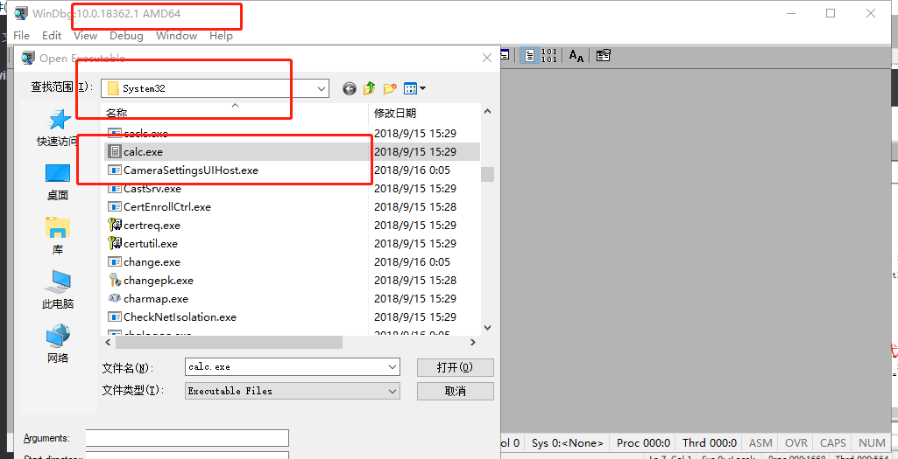

  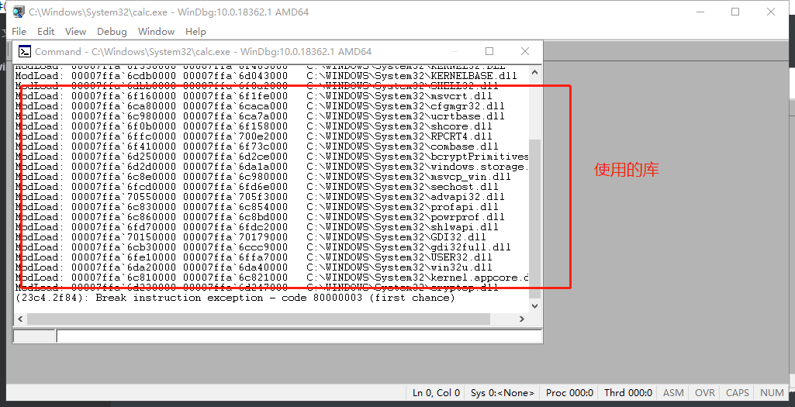

+ 打开其符号


symfix D:\symbols（缓存到本地目录）

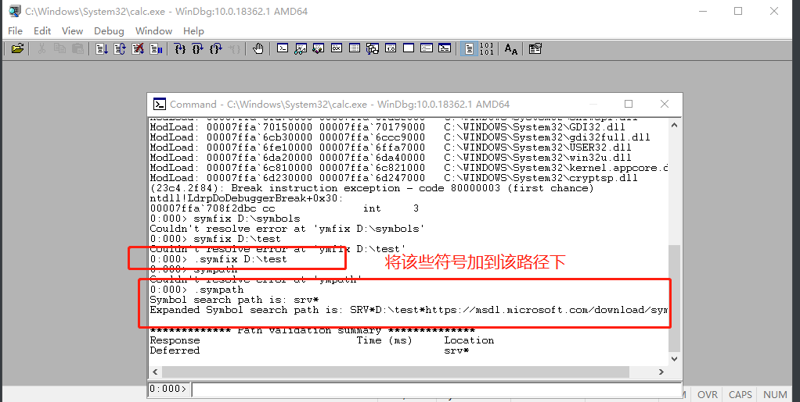

  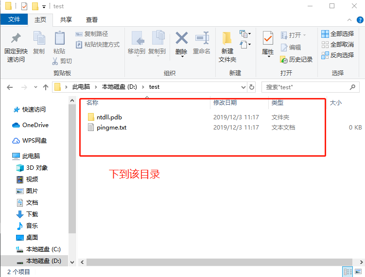


+ 开始调试

  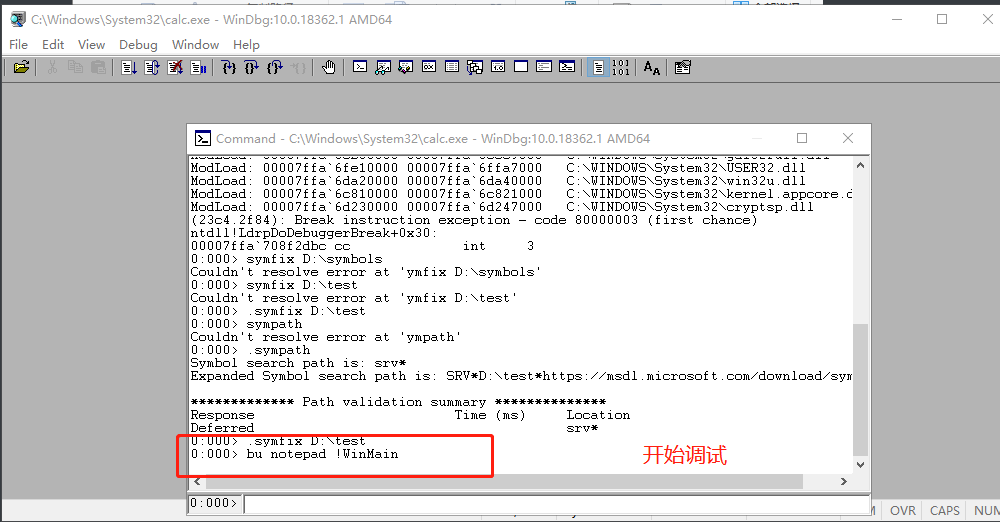

+ 但是由于我们输入的是notepad,会下错断点，所以会失败

  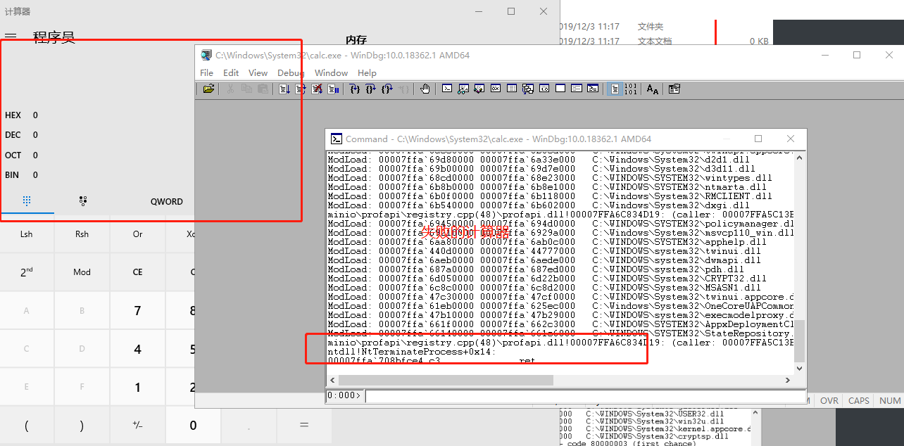

+ 需要注意的是，入口函数为：wWinMain

  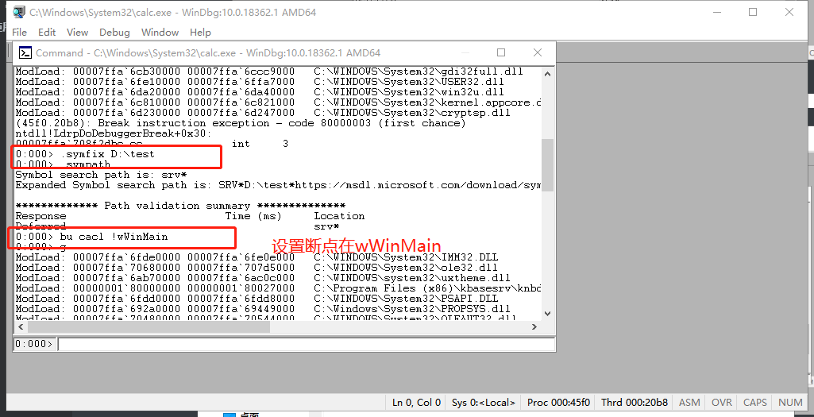

+ 接下来通过调试器监控计算器程序的数值将`666`改为`999`，逻辑是在传参的时候下断点，并将参数改为999，函数为`setwindowtextw`，先打开一个计算器，并且在windbg中attach to process

  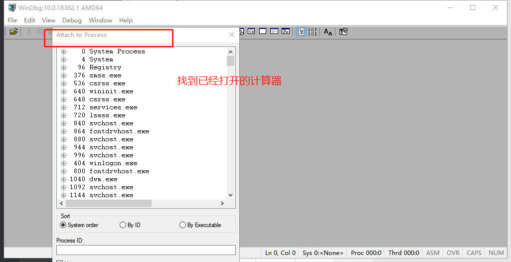

  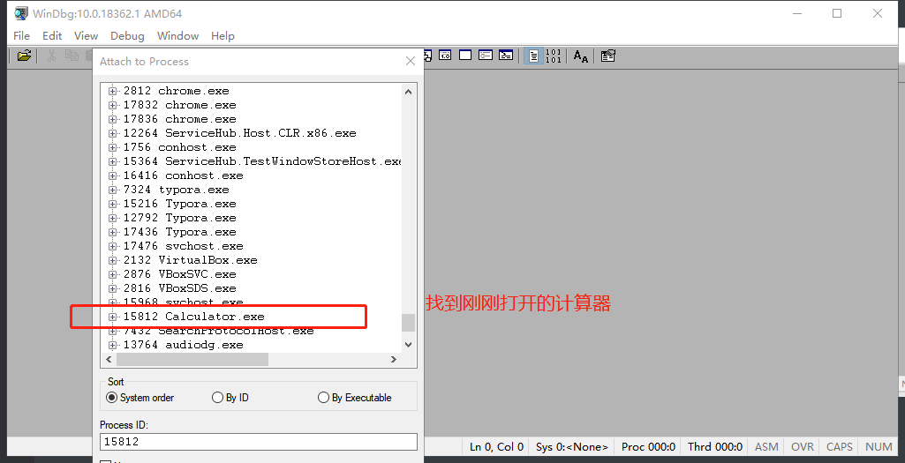

+ 尝试下断点调试

  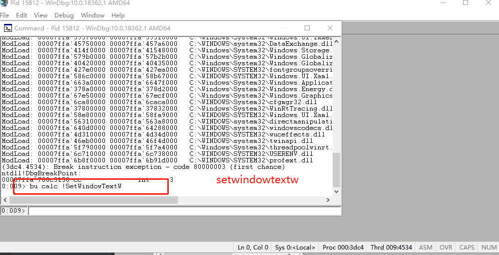
  
+ 发现该模块无法加载，查询发现在模块user32中，且正在加载
  
  ```bash
   bu user32 !SetWindowTextW
  ```
  
  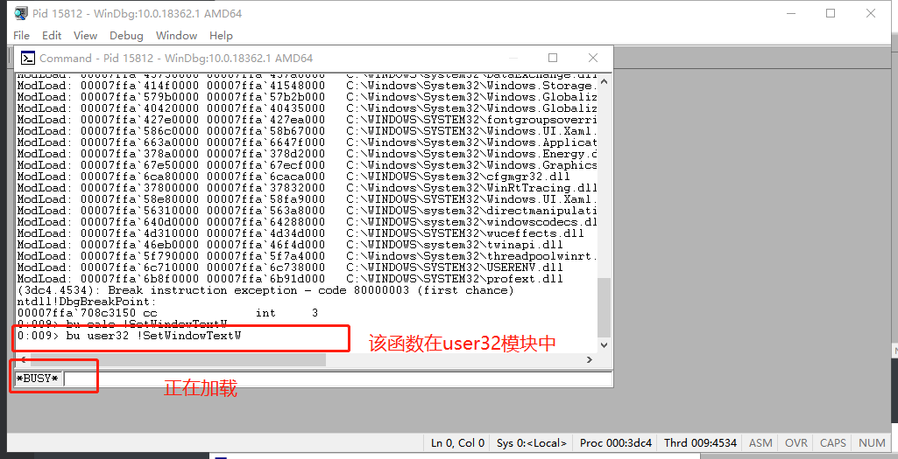
  
+ [setWindowText](https://docs.microsoft.com/en-us/windows/win32/api/winuser/nf-winuser-setwindowtexta)

  ```c++
  BOOL SetWindowTextA(
    HWND   hWnd,
    LPCSTR lpString
  );
  ```

  