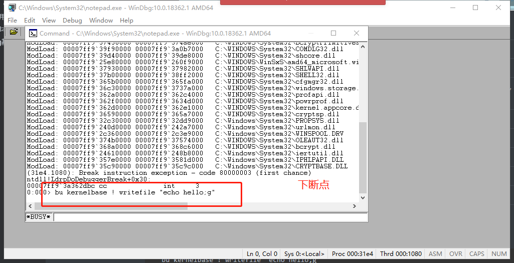

# windbg实验

## windbg基本使用实验

+ Windbg是在windows平台下，强大的用户态和内核态调试工具。相比较于Visual Studio，它是一个轻量级的调试工具
+ 安装winfbg，并查看其版本，最好与可执行程序版本一致


+ 在vs中写代码时，选择多线程调试（MTD模式）

  

+ 在windbg中打开.exe

  

+ 拖进路径（在symbol file path和source file path中添加路径）

  

+ 则代码可以开始调试

  

+ 使用windbg调试计算器，跑64位windbg，打开system32中的cal.exe，可以看到一系列调用的系统的库

  

  

+ 打开其符号


symfix D:\symbols（缓存到本地目录）


  


+ 开始调试

  

+ 但是由于我们输入的是notepad,会下错断点，所以会失败

  

+ 需要注意的是，入口函数为：wWinMain

  

+ 接下来通过调试器监控计算器程序的数值将`666`改为`999`，逻辑是在传参的时候下断点，并将参数改为999，函数为`setwindowtextw`，先打开一个计算器，并且在windbg中attach to process

  

  

+ 尝试下断点调试

  
  
+ 发现该模块无法加载，查询发现在模块user32中，且正在加载
  
  ```bash
   bu user32 !SetWindowTextW
  ```
  
  
  
+ [setWindowText](https://docs.microsoft.com/en-us/windows/win32/api/winuser/nf-winuser-setwindowtexta)

  ```c++
  BOOL SetWindowTextA(
    HWND   hWnd,
    LPCSTR lpString
  );
  ```


## windbg 脚本实验

### windbg基本命令使用

+ 方向键查看上条指令

+ 'u'指令查看后续若干指令

+ 'esc'清空所有内容

+ [windbg详细规则](https://docs.microsoft.com/en-us/windows-hardware/drivers/debugger/debugger-commands)

  

+ 表达式 `expr /s c++`可以改为c++的表达式,`??expression `命令

  

+ 如下地方可以查看各种窗口

  
  
+ `n 10`指定所有数据为十进制，默认为十六进制（以下命令`.format`改为`.formats`）
  
  
  
  
  
+ 设置别名
  
  
  
  
  
+ 用户自定义
  
  

+ 调试器自动设置的别名
  
  | 别名名称                  | 别名等价式                                                   |
  | :------------------------ | :----------------------------------------------------------- |
  | `$ntnsym`                 | NT 符号在系统原生架构中对应的模块，一般等于 `ntdll` or `nt`。 |
  | `$ntwsym`                 | 在 WOW64 上进行 32 位调试时，NT 符号在系统原生架构中对应的模块，一般为 `ntdll` 或者其他 32 位的`ntdll`。 |
  | `$ntsym`                  | 根据当前机器模式，找到 NT 符号对应的模块。一般与 `$ntnsym` 一致。 |
  | `$CurrentDumpFile`        | 调试器最后加载的 dump 文件名。                               |
  | `$CurrentDumpPath`        | 调试器最后加载的 dump 文件所在路径。                         |
  | `$CurrentDumpArchiveFile` | 调试器最后加载的 CAB 文件名。                                |
  | `$CurrentDumpArchivePath` | 调试器最后加载的 CAB 文件所在路径。                          |
  
+ 手动调试记事本(notepad.exe调用的式kernelbase.dll的库中的writefile以及ntdd.dll库中的writefile)
  
  每次到该断点都执行""中的命令，在writefile中下断点
  
  ```
  bu kernelbase ! writefile ".echo hello;g"
  ```
  
  
  
+ 打开记事本(windows下的notepad.exe)

  

+ 在记事本中输入各种语句并保存，会发现windbg中输出`hello`，说明断点设置成功了，每次保存都会输出一个hello

  


### 调试脚本

+ 脚本是一系列的调试命令组合而成的文本文件，通过调试脚本，用户实现自动化的调试和修改程序执行流程。

| 命令    | 文件名包含分号 | 与其他命令相连 | 缩短命令为一行 | 允许传递参数 |
| :------ | :------------- | :------------- | :------------- | :----------- |
| `$<`    | 是             | 否             | 否             | 否           |
| `$><`   | 是             | 否             | 是             | 否           |
| `$$<`   | 否             | 是             | 否             | 否           |
| `$$><`  | 否             | 是             | 是             | 否           |
| `$$>a<` | 否             | 是             | 是             | 是           |

+ 在脚本文件中添加`.echo hello`和`g`，$><表示全部缩成一行执行

  

  ```
  .foreach (value {dd 61000 L4})//dd表示查看内存内容
  {
     as /x ${/v:myAlias} value + 1
     .block{.echo value myAlias}
  }
  ```

+ 脚本`command.txt`中表示：如果保存了123456，则改成'hacked'，代码如下

  ```
  as /mu content poi(esp+0n24)//esp+9n24表示地址，poi表示访问后面地址中的值,as设置别名（content）
  .block{.if($scmp("${content}","123456")==0){ezu poi(esp+0n24) "hacked";}.else{.echo content}}//用block括起来，使得进入下一个代码块，content才能被正确展开，scmp是'string compare',ezu表示向内存写入后面的内容,u指unicode
  g
  ```

+ windbg64打开notepad

+ 设置断点

  ```
  bu kernelbase !writefile "$$<C:\\Users\\18801\\Desktop\\command.txt"
  ```

+ 在记事本中输入“123456”，并保存，会发现txt中会变成"hacked"，逻辑就是前面的设置了断点，在输入‘123456’后写入了'hacked'

  

+ [writefile msdn](https://docs.microsoft.com/en-us/windows/win32/api/fileapi/nf-fileapi-writefile)

  ```c++
  BOOL WriteFile(
    HANDLE       hFile,
    LPCVOID      lpBuffer,
    DWORD        nNumberOfBytesToWrite,
    LPDWORD      lpNumberOfBytesWritten,
    LPOVERLAPPED lpOverlapped
  );
  ```

  