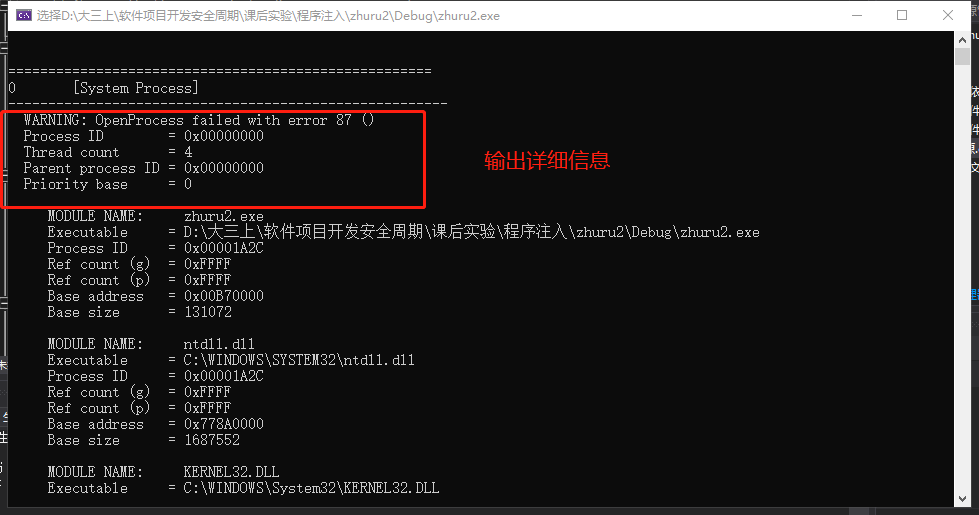

# 程序注入

## 实验目的

+ 通过对代码执行过程的学习来创建dll并调用文件，完成初步的程序注入

##  实验要求

- [x] 综合使用源代码的遍历进程结合dumpbin和process explore进行查看可执行程序依赖的动态库，把三种结果进行比较，在经过下面`Taking a Snapshot and Viewing Processes`和`动态链接库`的实验步骤以后，得出以下的最终结果的图，发现三种工具得出的结果大约一致相同

  

- [x] 会编写dll,把.c文件变为obj文件，把obj文件和lib文件链接为新的dll和lib文件，注意使用def文件定义导出函数（在下面的`创建并在load time调用dll文件`中已经完成
- [x] 编写一个.exe，调用第一步生成的dll文件中的导出函数。(也是在`创建并在load time调用dll文件`中完成）方法是

  + link是，将第一步生成的lib文件作为输入文件
  + 保证dll文件和exe文件放在同一个目录，或者dll文件在系统目录
- [x] 上一步调用方式称为load time，特点是exe文件导入表中会出现需要调用的dll文件名及函数名，并且在link生成Exe时，需明确输入lib文件；还有一种调用方式称为run time.参考官方文档，使用run time 的方式，调用dll的导出函数。包括系统API和第一步自行生成的dll,都能成功调用，这一步在`run time调用dll`中实现


## 实验过程

### Taking a Snapshot and Viewing Processes的学习

+ 操作系统内部包含了三个API，呈列表结构

  ```bash
  The following simple console application obtains a list of running processes. First, the GetProcessList function takes a snapshot of currently executing processes in the system using CreateToolhelp32Snapshot, and then it walks through the list recorded in the snapshot using Process32First and Process32Next. For each process in turn, GetProcessList calls the ListProcessModules function which is described in Traversing the Module List, and the ListProcessThreads function which is described in Traversing the Thread List.
  ```

+ C++代码及注释如下，以下程序的功能是遍历当前系统中所有的进程以及所有的模块和线程列表

  ```c++
  #include <windows.h>
  #include <tlhelp32.h>
  #include <tchar.h>
  
  //  Forward declarations:
  BOOL GetProcessList( );
  BOOL ListProcessModules( DWORD dwPID );
  BOOL ListProcessThreads( DWORD dwOwnerPID );
  void printError( TCHAR* msg );
  
  int main( void )
  {
    GetProcessList( );//调用函数
    return 0;
  }
  
  BOOL GetProcessList( )
  {
    HANDLE hProcessSnap;
    HANDLE hProcess;
    PROCESSENTRY32 pe32;
    DWORD dwPriorityClass;
  
    // Take a snapshot of all processes in the system.
    hProcessSnap = CreateToolhelp32Snapshot( TH32CS_SNAPPROCESS, 0 );//获得系统快照的句柄，即系统对象
    if( hProcessSnap == INVALID_HANDLE_VALUE )//判断是否成功
    {
      printError( TEXT("CreateToolhelp32Snapshot (of processes)") );
      return( FALSE );
    }
  
    // Set the size of the structure before using it.
    pe32.dwSize = sizeof( PROCESSENTRY32 );
  
    // Retrieve information about the first process,
    // and exit if unsuccessful
    if( !Process32First( hProcessSnap, &pe32 ) )//调用Process32得到第一个进程信息，保存在pe32中
    {
      printError( TEXT("Process32First") ); // show cause of failure
      CloseHandle( hProcessSnap );          // clean the snapshot object
      return( FALSE );
    }
  //Process32First检索有关系统快照中遇到的第一个进程的信息。
      //BOOL Process32First(
   // HANDLE           hSnapshot,
    //LPPROCESSENTRY32 lppe
  //);
    // Now walk the snapshot of processes, and
    // display information about each process in turn
    do
    {//打印输出进程结果
      _tprintf( TEXT("\n\n=====================================================" ));
      _tprintf( TEXT("\nPROCESS NAME:  %s"), pe32.szExeFile );
      _tprintf( TEXT("\n-------------------------------------------------------" ));
  
      // Retrieve the priority class.
      dwPriorityClass = 0;
      hProcess = OpenProcess( PROCESS_ALL_ACCESS, FALSE, pe32.th32ProcessID );
      if( hProcess == NULL )
        printError( TEXT("OpenProcess") );
      else
      {
        dwPriorityClass = GetPriorityClass( hProcess );
        if( !dwPriorityClass )
          printError( TEXT("GetPriorityClass") );
        CloseHandle( hProcess );
      }
  
      _tprintf( TEXT("\n  Process ID        = 0x%08X"), pe32.th32ProcessID );//进程ID
      _tprintf( TEXT("\n  Thread count      = %d"),   pe32.cntThreads );//线程数量
      _tprintf( TEXT("\n  Parent process ID = 0x%08X"), pe32.th32ParentProcessID );//父进程ID
      _tprintf( TEXT("\n  Priority base     = %d"), pe32.pcPriClassBase );
      if( dwPriorityClass )
        _tprintf( TEXT("\n  Priority class    = %d"), dwPriorityClass );
  
      // List the modules and threads associated with this process
      ListProcessModules( pe32.th32ProcessID );//遍历进程的模块
      ListProcessThreads( pe32.th32ProcessID );//遍历进程所有的线程
  
    } while( Process32Next( hProcessSnap, &pe32 ) );//Process32Next检索有关系统快照中记录的下一个进程的信息。
  
    CloseHandle( hProcessSnap );
    return( TRUE );
  }
  
  
  BOOL ListProcessModules( DWORD dwPID )
  {
    HANDLE hModuleSnap = INVALID_HANDLE_VALUE;
    MODULEENTRY32 me32;
  
    // Take a snapshot of all modules in the specified process.
    hModuleSnap = CreateToolhelp32Snapshot( TH32CS_SNAPMODULE, dwPID );
    if( hModuleSnap == INVALID_HANDLE_VALUE )
    {
      printError( TEXT("CreateToolhelp32Snapshot (of modules)") );
      return( FALSE );
    }
  
    // Set the size of the structure before using it.
    me32.dwSize = sizeof( MODULEENTRY32 );
  
    // Retrieve information about the first module,
    // and exit if unsuccessful
    if( !Module32First( hModuleSnap, &me32 ) )
    {
      printError( TEXT("Module32First") );  // show cause of failure
      CloseHandle( hModuleSnap );           // clean the snapshot object
      return( FALSE );
    }
  
    // Now walk the module list of the process,
    // and display information about each module
    do
    {
      _tprintf( TEXT("\n\n     MODULE NAME:     %s"),   me32.szModule );
      _tprintf( TEXT("\n     Executable     = %s"),     me32.szExePath );
      _tprintf( TEXT("\n     Process ID     = 0x%08X"),         me32.th32ProcessID );
      _tprintf( TEXT("\n     Ref count (g)  = 0x%04X"),     me32.GlblcntUsage );
      _tprintf( TEXT("\n     Ref count (p)  = 0x%04X"),     me32.ProccntUsage );
      _tprintf( TEXT("\n     Base address   = 0x%08X"), (DWORD) me32.modBaseAddr );
      _tprintf( TEXT("\n     Base size      = %d"),             me32.modBaseSize );
  
    } while( Module32Next( hModuleSnap, &me32 ) );
  
    CloseHandle( hModuleSnap );
    return( TRUE );
  }
  
  BOOL ListProcessThreads( DWORD dwOwnerPID ) 
  { 
    HANDLE hThreadSnap = INVALID_HANDLE_VALUE; 
    THREADENTRY32 te32; 
   
    // Take a snapshot of all running threads  
    hThreadSnap = CreateToolhelp32Snapshot( TH32CS_SNAPTHREAD, 0 ); 
    if( hThreadSnap == INVALID_HANDLE_VALUE ) 
      return( FALSE ); 
   
    // Fill in the size of the structure before using it. 
    te32.dwSize = sizeof(THREADENTRY32); 
   
    // Retrieve information about the first thread,
    // and exit if unsuccessful
    if( !Thread32First( hThreadSnap, &te32 ) ) 
    {
      printError( TEXT("Thread32First") ); // show cause of failure
      CloseHandle( hThreadSnap );          // clean the snapshot object
      return( FALSE );
    }
  
    // Now walk the thread list of the system,
    // and display information about each thread
    // associated with the specified process
    do 
    { 
      if( te32.th32OwnerProcessID == dwOwnerPID )
      {
        _tprintf( TEXT("\n\n     THREAD ID      = 0x%08X"), te32.th32ThreadID ); 
        _tprintf( TEXT("\n     Base priority  = %d"), te32.tpBasePri ); 
        _tprintf( TEXT("\n     Delta priority = %d"), te32.tpDeltaPri ); 
        _tprintf( TEXT("\n"));
      }
    } while( Thread32Next(hThreadSnap, &te32 ) ); 
  
    CloseHandle( hThreadSnap );
    return( TRUE );
  }
  
  void printError( TCHAR* msg )
  {
    DWORD eNum;
    TCHAR sysMsg[256];
    TCHAR* p;
  
    eNum = GetLastError( );
    FormatMessage( FORMAT_MESSAGE_FROM_SYSTEM | FORMAT_MESSAGE_IGNORE_INSERTS,
           NULL, eNum,
           MAKELANGID(LANG_NEUTRAL, SUBLANG_DEFAULT), // Default language
           sysMsg, 256, NULL );
  
    // Trim the end of the line and terminate it with a null
    p = sysMsg;
    while( ( *p > 31 ) || ( *p == 9 ) )
      ++p;
    do { *p-- = 0; } while( ( p >= sysMsg ) &&
                            ( ( *p == '.' ) || ( *p < 33 ) ) );
  
  // Display the message
    _tprintf( TEXT("\n  WARNING: %s failed with error %d (%s)"), msg, eNum, sysMsg );
  }
  ```
  
+ 在vs中创建一个新项目，并复制代码，运行结果为

  

+ 在`cmd`窗口中的`tasklist`以及`任务管理器`中可以查看到一样的结果（代码注释多余块以后）

  ```c++
  #include <windows.h>
  #include <tlhelp32.h>
  #include <tchar.h>
  #include<stdio.h>
  
  //  Forward declarations:
  BOOL GetProcessList();
  BOOL ListProcessModules(DWORD dwPID);
  BOOL ListProcessThreads(DWORD dwOwnerPID);
  void printError(TCHAR* msg);
  
  int main(void)
  {
  	GetProcessList();
  	return 0;
  }
  
  BOOL GetProcessList()
  {
  	HANDLE hProcessSnap;
  	HANDLE hProcess;
  	PROCESSENTRY32 pe32;
  	DWORD dwPriorityClass;
  
  	// Take a snapshot of all processes in the system.
  	hProcessSnap = CreateToolhelp32Snapshot(TH32CS_SNAPPROCESS, 0);  //得到快照句柄，系统对象可被操作的对象ID，文件窗口，进程，现场
  
  	if (hProcessSnap == INVALID_HANDLE_VALUE)
  	{
  		printError(TEXT("CreateToolhelp32Snapshot (of processes)"));
  		return(FALSE);
  	}
  
  	// Set the size of the structure before using it.
  	pe32.dwSize = sizeof(PROCESSENTRY32);
  
  	// Retrieve information about the first process,
  	// and exit if unsuccessful
  	if (!Process32First(hProcessSnap, &pe32))
  	{
  		printError(TEXT("Process32First")); // show cause of failure
  		CloseHandle(hProcessSnap);          // clean the snapshot object
  		return(FALSE);
  	}
  
  	// Now walk the snapshot of processes, and
  	// display information about each process in turn
  	do
  	{
  		_tprintf(TEXT("\n\n====================================================="));
  		//_tprintf(TEXT("\nPROCESS NAME:  %s"), pe32.szExeFile);
  		_tprintf(TEXT("\n%d\t%s"), pe32.th32ProcessID, pe32.szExeFile);
  		_tprintf(TEXT("\n-------------------------------------------------------"));
  
  	} while (Process32Next(hProcessSnap, &pe32));
  
  	CloseHandle(hProcessSnap);
  	return(TRUE);
  }
  
  
  BOOL ListProcessModules(DWORD dwPID)
  {
  	HANDLE hModuleSnap = INVALID_HANDLE_VALUE;
  	MODULEENTRY32 me32;
  
  	// Take a snapshot of all modules in the specified process.
  	hModuleSnap = CreateToolhelp32Snapshot(TH32CS_SNAPMODULE, dwPID);//获得dwPID下面的快照
  	if (hModuleSnap == INVALID_HANDLE_VALUE)
  	{
  		printError(TEXT("CreateToolhelp32Snapshot (of modules)"));
  		return(FALSE);
  	}
  
  	// Set the size of the structure before using it.
  	me32.dwSize = sizeof(MODULEENTRY32);
  
  	// Retrieve information about the first module,
  	// and exit if unsuccessful
  	if (!Module32First(hModuleSnap, &me32))
  	{
  		printError(TEXT("Module32First"));  // show cause of failure
  		CloseHandle(hModuleSnap);           // clean the snapshot object
  		return(FALSE);
  	}
  
  	// Now walk the module list of the process,
  	// and display information about each module
  	do
  	{
  		_tprintf(TEXT("\n\n     MODULE NAME:     %s"), me32.szModule);
  		_tprintf(TEXT("\n     Executable     = %s"), me32.szExePath);
  		_tprintf(TEXT("\n     Process ID     = 0x%08X"), me32.th32ProcessID);
  		_tprintf(TEXT("\n     Ref count (g)  = 0x%04X"), me32.GlblcntUsage);
  		_tprintf(TEXT("\n     Ref count (p)  = 0x%04X"), me32.ProccntUsage);
  		_tprintf(TEXT("\n     Base address   = 0x%08X"), (DWORD)me32.modBaseAddr);
  		_tprintf(TEXT("\n     Base size      = %d"), me32.modBaseSize);
  
  	} while (Module32Next(hModuleSnap, &me32));
  
  	CloseHandle(hModuleSnap);
  	return(TRUE);
  }
  
  BOOL ListProcessThreads(DWORD dwOwnerPID)
  {
  	HANDLE hThreadSnap = INVALID_HANDLE_VALUE;
  	THREADENTRY32 te32;
  
  	// Take a snapshot of all running threads  
  	hThreadSnap = CreateToolhelp32Snapshot(TH32CS_SNAPTHREAD, 0);
  	if (hThreadSnap == INVALID_HANDLE_VALUE)
  		return(FALSE);
  
  	// Fill in the size of the structure before using it. 
  	te32.dwSize = sizeof(THREADENTRY32);
  
  	// Retrieve information about the first thread,
  	// and exit if unsuccessful
  	if (!Thread32First(hThreadSnap, &te32))
  	{
  		printError(TEXT("Thread32First")); // show cause of failure
  		CloseHandle(hThreadSnap);          // clean the snapshot object
  		return(FALSE);
  	}
  
  	// Now walk the thread list of the system,
  	// and display information about each thread
  	// associated with the specified process
  	do
  	{
  		if (te32.th32OwnerProcessID == dwOwnerPID)
  		{
  			_tprintf(TEXT("\n\n     THREAD ID      = 0x%08X"), te32.th32ThreadID);
  			_tprintf(TEXT("\n     Base priority  = %d"), te32.tpBasePri);
  			_tprintf(TEXT("\n     Delta priority = %d"), te32.tpDeltaPri);
  			_tprintf(TEXT("\n"));
  		}
  	} while (Thread32Next(hThreadSnap, &te32));
  
  	CloseHandle(hThreadSnap);
  	return(TRUE);
  }
  
  void printError(TCHAR* msg)
  {
  	DWORD eNum;
  	TCHAR sysMsg[256];
  	TCHAR* p;
  
  	eNum = GetLastError();
  	FormatMessage(FORMAT_MESSAGE_FROM_SYSTEM | FORMAT_MESSAGE_IGNORE_INSERTS,
  		NULL, eNum,
  		MAKELANGID(LANG_NEUTRAL, SUBLANG_DEFAULT), // Default language
  		sysMsg, 256, NULL);
  
  	// Trim the end of the line and terminate it with a null
  	p = sysMsg;
  	while ((*p > 31) || (*p == 9))
  		++p;
  	do { *p-- = 0; } while ((p >= sysMsg) &&
  		((*p == '.') || (*p < 33)));
  
  	// Display the message
  	_tprintf(TEXT("\n  WARNING: %s failed with error %d (%s)"), msg, eNum, sysMsg);
  }
  ```

  

+ 不注释掉多余的代码，输出如下，包含模块名和对应的可执行文件，文件名是`dll`或者是`exe`，且有且只有一个`exe`文件，有数量不等的`dll`文件

  

  

+ 同时，也可以打开vs开发者工具输入`dumpbin`查看调用的模块，发现API都在dll模块中，程序执行过程：进程遍历--进程模块的遍历--线程的遍历，而软件模块注入就是向程序中注入一个恶意的模块

+ 通过下载[process manager](https://docs.microsoft.com/en-us/sysinternals/)，这就是上述`程序遍历`代码的执行的UI界面，从而对比各种工具得到以下的结果图

  

  

+ 通过上述观察得出以下的调用关系，而攻击者容易进行攻击的就是最底层的dll库

  
  

### 动态链接库

+ [参考代码](https://docs.microsoft.com/en-us/previous-versions/visualstudio/visual-studio-2008/1ez7dh12(v=vs.90))

+ 链接是指把若干个程序的组成部分链接在一起，以下是vs中的链接器

+ 新建一个工程，添加一个`a.c`，输入如下代码会报以下俩个错

  

+ 打开vs开发者工具，进入到刚刚源代码的目录并执行`cl.exe /c a.c`

  

+ 在同一目录下添加一个`b.c`

  ```c++
  #include<Windows.h>
  int sub()
  {
  	MessageBox(0, "msg", 0, 0);
  	return 0;
  }
  ```

+ 同时，链接a.c和b.c，命令为`link a.obj b.obj /out:hehe.exe`，发现出错：无法找到模块

  

+ 将命令转为`link a.obj b.obj User32.lib /out:hehe.exe`，添加`User32.lib`这个模块，则链接成功，并生成了hehe.exe，链接的主要工作就是将需要用到的模块进行排列

  
  
+ 输入dumpbin可以查看需要用到的库`dumpbin /imports hehe.exe`
  
  
  
+ 动态链接是指在不同的可执行文件中，距离不确定，需要执行时才能知道，而静态链接则只在一个文件中，排列成一定的顺序，通常自己编写的代码是静态链接，而系统的API是进行动态链接
  
+ `dumpbin /exports C:\Windows\System32\user32.dll >D:\大三上\软件项目开发安全周期\课后实验\程序注入\1919\data.txt`将库信息输入到data.txt中，`imports`表示需要用到的信息（导入表），`exports`告诉初始化程序messagebox函数在对应的地址（导出表）
  
  
  
  
  
+ 之所以需要动态链接机制的原因是
  
  + 静态链接每次都要进行编译成源代码，浪费空间
  + 静态链接可执行文件会很大，当发现代码需要升级时，需要把所有使用过该代码的程序进行升级，这可行性不高而且浪费时间，动态链接只用维护自己的代码即可，他人调用时则自动升级
  + 倘若开发者在开发应用时源代码不愿意公开，则只需要提供dll，则闭源系统也能对外进行开放，被调用
  
  

### 创建并在load time调用dll文件

+ [模块定义](https://docs.microsoft.com/en-us/cpp/build/reference/module-definition-dot-def-files?view=vs-201)

+ 新建一个工程，建一个`base.c`

  ```c++
  #include<Windows.h>
  
  
  int intnal_function()
  {
  	return 0;
  }
  int lib_function(char* msg)
  {
  	//do some works
  	MessageBoxA(0, "msg from base lib", msg, "OK");
  }
  ```

+ 新建一个`exp.def`

  ```c++
  LIBRARY baselib
  EXPORTS
      lib_function
  ```
  
+ 开发者工具进入源代码的目录，并对刚刚的base.c进行编译链接

  

  

+ 上述需要在vs的属性页中进行如下配置

  
  
  
  
  
  
+ 新建一个工程app,代码如下
  
  ```c++
  int main()
  {
  	lib_function("call a dll");
  }
  ```
  
+ 进行编译并链接`cl.exe /c app.c`进行编译以及`link app.obj +baselib.dll /dll /out:app.exe`进行链接，之后成功，并使用dumpbin能查看到baselib.dll的存在


### run time调用dll

+ 我们需要知道的是.exe-->（调用）dll有两种方式，上面调用的方式是load time，
  + load time
    + link lib
    + imports table
  + run time 
  + 指针
  
+ 参考命令

  ```bash
  link /dll /def:xxx.def   #生成dll文件
  link xxx.lib /out:app.exe #生成exe文件
  dumpbin /exports xxx.dll #查看引用模块的内存地址
  dumpbin /imports xxx.exe  #查看引用的模块
  ```

+ 新建一个工程，执行如下代码

  ```c++
  // A simple program that uses LoadLibrary and 
  // GetProcAddress to access myPuts from Myputs.dll. 
   
  #include <windows.h> 
  #include <stdio.h> 
   
  typedef int (__cdecl *MYPROC)(LPWSTR); 
   
  int main( void ) 
  { 
      HINSTANCE hinstLib; 
      MYPROC ProcAdd; 
      BOOL fFreeResult, fRunTimeLinkSuccess = FALSE; 
   
      // Get a handle to the DLL module.
   
      hinstLib = LoadLibrary(TEXT("MyPuts.dll")); 
   
      // If the handle is valid, try to get the function address.
   
      if (hinstLib != NULL) 
      { 
          ProcAdd = (MYPROC) GetProcAddress(hinstLib, "myPuts"); 
   
          // If the function address is valid, call the function.
   
          if (NULL != ProcAdd) 
          {
              fRunTimeLinkSuccess = TRUE;
              (ProcAdd) (L"Message sent to the DLL function\n"); 
          }
          // Free the DLL module.
   
          fFreeResult = FreeLibrary(hinstLib); 
      } 
  
      // If unable to call the DLL function, use an alternative.
      if (! fRunTimeLinkSuccess) 
          printf("Message printed from executable\n"); 
  
      return 0;
  
  }
  ```

+ 上面的示例使用[**LoadLibrary**](https://msdn.microsoft.com/library/ms684175(v=VS.85).aspx)函数获取Myputs DLL的句柄（请参阅[创建简单的动态链接库](https://docs.microsoft.com/zh-cn/windows/win32/dlls/creating-a-simple-dynamic-link-library)）。如果**LoadLibrary**成功，则程序将使用[**GetProcAddress**](https://msdn.microsoft.com/library/ms683212(v=VS.85).aspx)函数中返回的句柄来获取DLL的myPuts函数的地址。调用DLL函数后，程序将调用[**FreeLibrary**](https://msdn.microsoft.com/library/ms683152(v=VS.85).aspx)函数以卸载DLL。

+ 因为该程序使用运行时动态链接，所以不必将模块与DLL的导入库链接。

+ 此示例说明了运行时动态链接和加载时动态链接之间的重要区别。如果DLL不可用，则使用加载时动态链接的应用程序必须简单地终止。但是，运行时动态链接示例可以响应该错误。

+ 即在创建dll库之前，我们就执行该段代码，会发现程序可以进行正常执行，只不过会报`Message printed from executable`，这说明运行时链接可以编译通过并且执行，及时响应错误，而不会像加载时链接一样，运行不成功

  

+ 接着，使用上面实验的方法创建一个`Myputd.dll`库

  ```bash
  cl.exe /c Myputs.c#编译
  link Myputs.obj /out:vase.dll /dll #创建dll库
  ```

  

+ 查看文件目录`dir`

  

+ 接着重新执行刚刚的文件，会发现执行成功，且不再报刚刚的信息，而是报成功的信息`Message sent to the DLL function`

  
  
+ 由此可以看出，运行时动态链接和加载时动态链接最大的区别就是，没有dll的存在，运行时链接可以进行响应，不会影响其正常运行，只是无法达到效果，而加载时动态链接则是运行不成功，终止，因为链接时出错了
  
  

## 实验总结

+ 运行时动态链接和加载时动态链接之间的重要区别。如果DLL不可用，则使用加载时动态链接的应用程序必须简单地终止。但是，运行时动态链接示例可以响应该错误。

+ 程序注入一般的对象是dll库，修改并注入，则可以达到攻击者预想的效果

+ 程序执行的调用关系如下，而攻击者容易进行攻击的就是最底层的dll库

  


## 实验参考资料

+ [process explore使用](https://blog.csdn.net/yasi_xi/article/details/39295843)
+ [view process msdn](https://docs.microsoft.com/zh-cn/windows/win32/toolhelp/taking-a-snapshot-and-viewing-processes)
+ [dynamic link](https://docs.microsoft.com/zh-cn/windows/win32/dlls/using-run-time-dynamic-linking)

