# 软件安全开发生命周期

## 软件的执行原理

### 原生应用程序

1. .c--.exe 编译链接 vs里用的是cl cmd中可用clang（clang需要添加到环境变量,实现的是编译+链接）

2. 课堂实例代码:

   
   
```c
   #include <studio.h>
   #include<stdlib.h>
   
   int main()
{
   printf("hello world\n");
}
```

   

   用winhex打开.exe,打开ASCII表，找到小写字母“h"，h对应的Ascii码是0x68，在winhex中也能看到这种对应关系，只有一部分信息可以显示

### 脚本程序

1. 脚本用来写网络程序的，Windows系统中的.exe直接可以运行的，都是原生程序，通常是用c/c++编写的。
2. python.exe和CPU，python.exe也是运行在CPU之上的，python.exe读取py文件，进行解析，模拟CPU工作，调用基础的库等等，突破了CPU只能解析二进制文件。
3. 运行性能快，使用CPU的原生应用程序执行；开发效率要高，使用脚本程序，同样，开发复杂的软件也是
4. 浏览器本身也是一个执行器，可以执行类似javascript的脚本程序，python，JavaScript，PHP（均为脚本程序）

### 软件开发安全分类

#### exe原生程序的安全（二进制）

#### 脚本程序的安全（网络应用）

 数据泄露，逻辑校验不完整（例如，跨站脚本攻击--论坛上发评论，他人可以看到，嵌入一段script的标签，后台把这个script当做是评论直接上传，而他人的系统上可以解析脚本，可能可以获取很多信息）

### 了解http html

1. 爬虫

2. 抓包器和协议解析

### 下节课预告

1. 二进制漏洞挖掘与利用
2. 缓冲区溢出
3. 堆溢出

---


## 190918第三次课

### 复习：原生应用程序特点

1. 需要有原生应用程序编译器
2. 直接 
3. 性能高
4. 开发相对难
5. 编译链接过程：.c--编译--.o--链接（printf调用系统API）--.exe
6. dumpbin /disasm a.exe可以进行反汇编，可以查看.exe的反汇编语言，汇编程序是为了便于读指令而设计的。

### HTML：一种标签化的语言

### 浏览器的三大功能--原生app的实例

+ 通过网络与客户端进行交互
+ 是一个html的渲染器，解析显示
+ 执行脚本（交互、数据、动态效果）
+ 与抓包器不同，抓包器需要在OS下层，直接从网卡上抓包

### 课堂实验

1. 打开wiireshark进行抓包

2. python抓包实例：requests,lxml库,etree,xpath:通过路径的方式定位了html树中元素的位置（//div表示前面可以是任意元素，还可以加属性，//div[class='a']，text()获取文本,()函数，[]属性，//路径），//tr/td[1]：所有表格的第一列
3. 找漏洞：先去查找可疑的漏洞，提交数据的文本框


---


## 190924第四次课

### 生成公私钥对


---

## 191008第五次课

### 跨站脚本攻击原理

+ 用户提交的信息存到数据库

  userA（提交的信息包含javascript)-->server(存储到DB）-->userB（执行该脚本），执行的结果传到userA(攻击者)，可以用来盗取用户名密码等等

### SQL注入

+ 数据泄露，写入数据库等等

### 存在漏洞的程序

```c
#include <stdlib.h>
#include <stdio.h>
#include <string.h>
int main(int argc,char ** argv)//argc是命令行中参数个数（程序本身需要占一个），argv是参数值，是一个字符串类型的数组
{
    char y[10];//变量定义--内存分配，此处分配10个char型的内存大小
    if(argc >1)
{
    strcpy(y,argv[1]);//可能会写入越界，是很大的安全问题
}
}
```

```c
int sub(char *x)
{
    char y[10];
    strcpy_s(y,strlen(x),x);//本来应该为strcpy_s(y,10,x);现在只比较x的长度和x本身，还是可能会造成越界
    return 0;
}//在vs中程序属性中的安全检查等等关掉，则程序会直接崩溃
```

### CVE,cnnvd,cnvd

+ [CVE](https://cve.mitre.org/)下载
+ [cnnvd](http://www.cnnvd.org.cn/web/vulnerability/querylist.tag)：国家信息安全漏洞
+ [cnvd](http://www.cnvd.org.cn/webinfo/show/4111)：同上，不同公司研发的

### XSS

### 实验要求

+ http server
  + 启动httpd（netstart -l查看端口：80）,apache等等web server-->目录-->放入静态页面a.html
  + client输入127.0.0.1\a.html访问
  + 抓包器抓一下请求响应的过程

+ 写一个简单的动态脚本，用php做一个乘法器，在nginx,apache（web服务器）（不仅可以处理静态页面，还可以处理php的脚本）,可以根据用户请求进行响应，调用数据库
+ 利用django快速构建一个web应用,按照mvt,数据模型写在models.py，渲染{{变量名}}主体框架是静态的，内容是动态的

### django :

+ [django](https://docs.djangoproject.com/en/2.2/)

+ M->**定义数据模型**-->表结构
+ V-->**编写功能列表**
+ T-->**定义页面模板**
+ ORM：定义类即可
+ [安装django](https://www.djangoproject.com/download/)


---


## 缓冲区溢出漏洞

#### 代码示例

```c
#define _CRT_SECURE_NO_WARNINGS

#include<stdlib.h>
#include<stdio.h>
#include<string.h>

int sub(char*x)
{
	char y[10];
	strcpy(y, x);
	return 0;
}

int main(int argc, char** argv)
{
	if (argc > 1)
		sub(argv[1]);
	printf("exit");
}
```

+ 实验步骤

  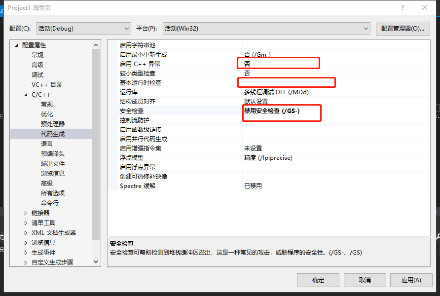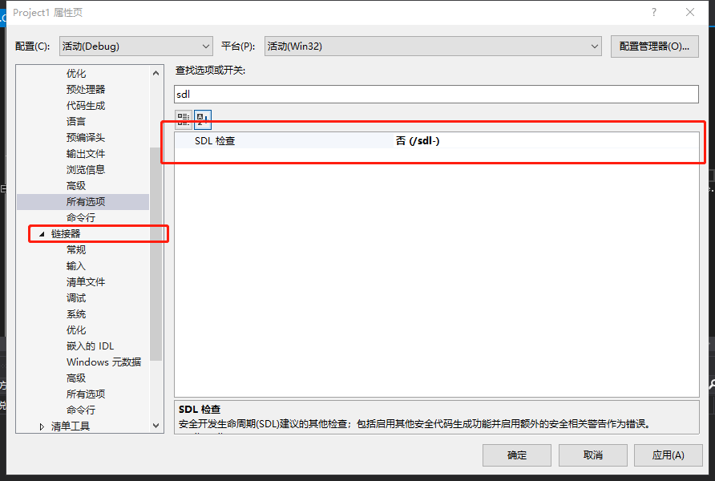

  

  调试过程中

  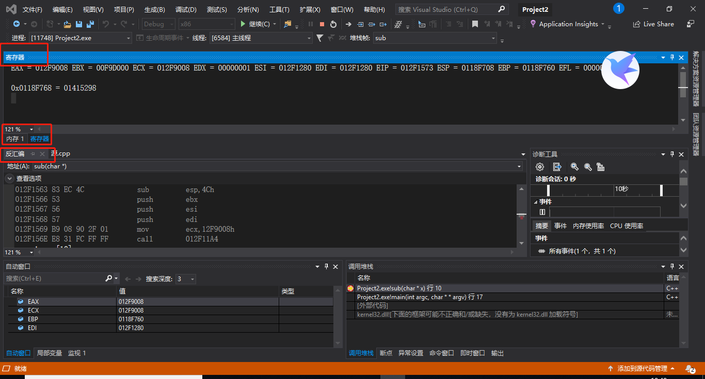

  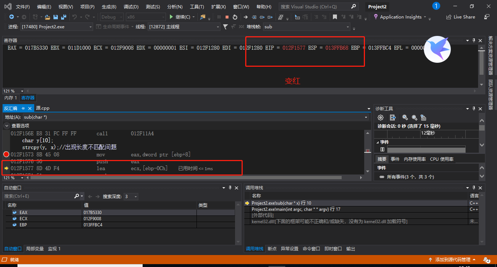

 + 安全问题产生的原因

 + esp：存栈顶指针

 + push eax

   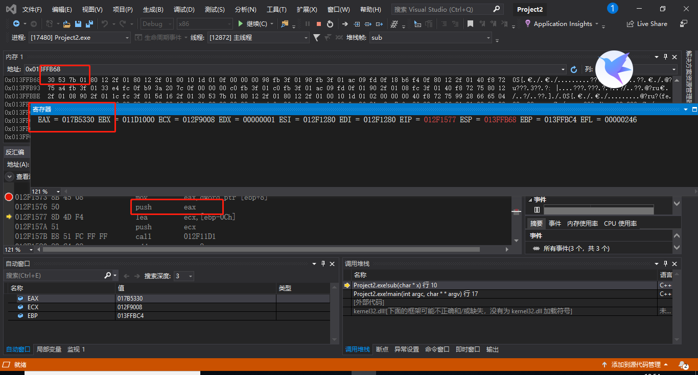

+ call 

  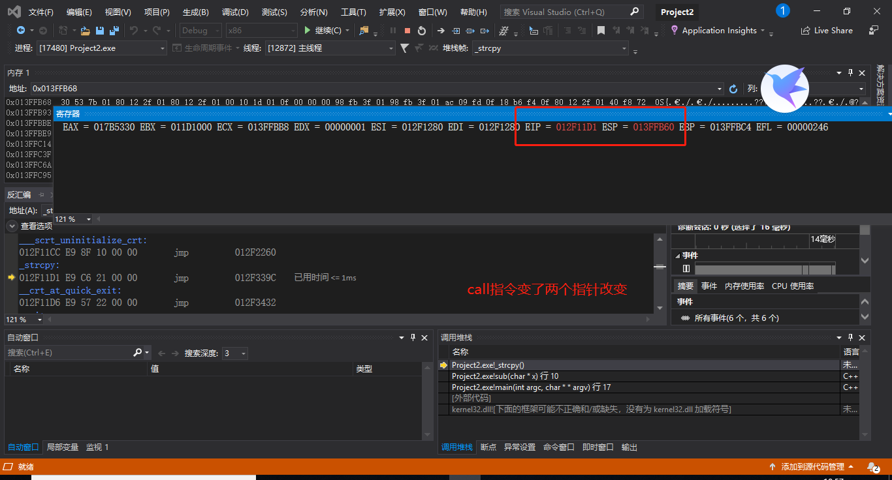

+ 局部变量也存在栈中，只使用一段时间内存空间

+ 全局变量放在其他位置，整个程序有效

+ 断点设在主函数

  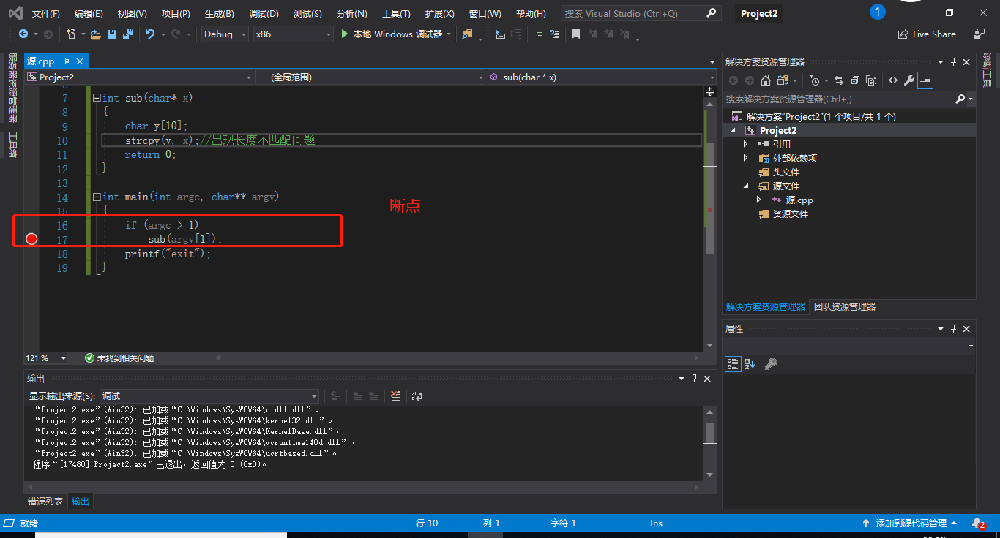

+ 出错步骤：该地址不存在，此时我们的输入数据是999999999999，倘若改为一些有效的地址，黑客可以进行攻击，程序控制流程被修改，例如：发一个word文件，中了一个木马

  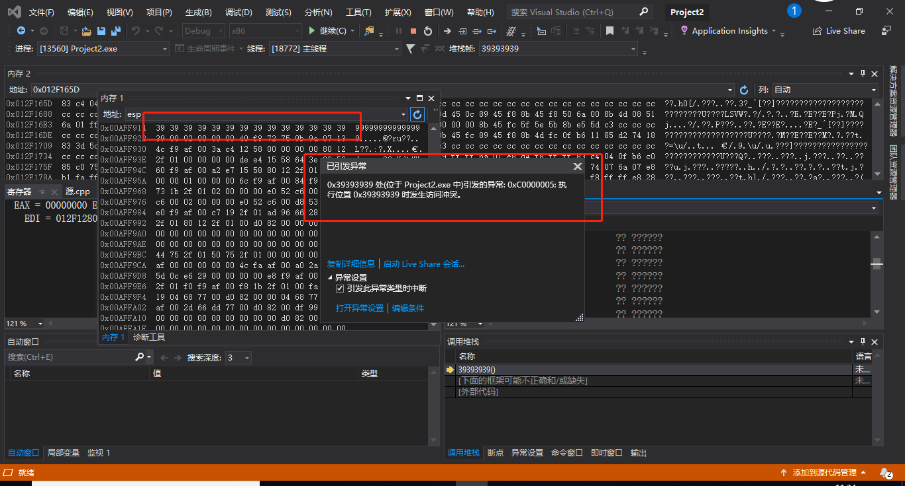

  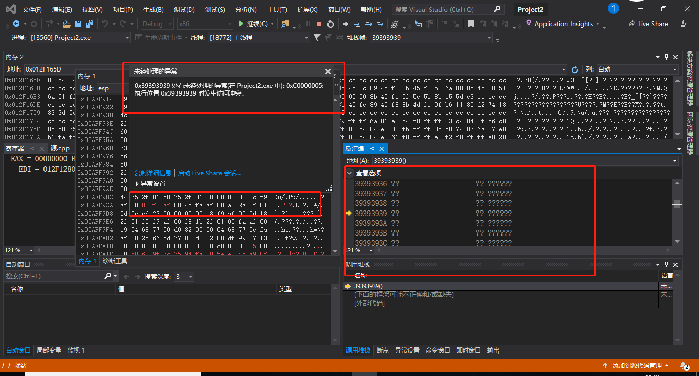

+ 总结：

  + argc[1]入栈（**参数**）-->main call下一条地址入栈(**返回地址**）-->ebp(旧)入栈（**caller栈基址**）-->epb-4ch（为函数的**局部变量**分配空间）-->x入栈-->y入栈-->sub--strcpy下一条指令
  + 以上四个加粗部分统称为栈帧

  + ebp是用来定位局部变量的，是栈帧基址指针
  + strcpy正常执行，栈没被破坏，sub函数的栈帧被破坏了，因此回不到主调函数了

  


---

## 191022课程

#### 必备技能

+ git --pro git

+ markdown :可对比，版本化管理，格式简洁

+ 两种主要程序的不同：原生应用程序和Web应用程序（网络APP）

  + 原生应用程序：win(exe)/linux(elf)，需要通过编译链接，二进制程序--PE文件是机器指令，和汇编语言一一对应

+ 程序执行过程：利用调试器(debuger)进行观察（eip等等寄存器),调试器如下

  + vs自带的/windbg gbd

  + vc -->vs/gnu-->gcc

  + 调试器的基本使用：断点/单步执行/反汇编（.c/.cpp源文件与汇编对应关系）/内存/寄存器

  + 调用流程图

    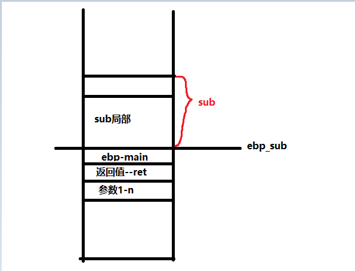

  + 全局变量在堆中分配，局部变量在栈中分配

  + 尽量少使用全局变量，在程序的整个生命周期都会占用内存


---

## 堆溢出漏洞

+ malloc/free函数，在程序的执行过程中可以多次malloc,且多次不定时free

+ 堆是一个双向链表，删除一个节点：将后项节点的前项指针指向前项节点，前项节点的后项指针指向后项节点，即将前项节点的数据写入后项节点，若被覆盖，则会向任意节点写入任意数据

+ 这是一个漏洞，因为可以向任意节点写入任意数据（free从链表中的该段数据脱链）

+ 代码示例（栈溢出）

  ```c
  #define _CRT_SECURE_NO_WARNINGS
  
  #include<stdlib.h>
  #include<stdio.h>
  #include<string.h>
  int hacked()
  {
  	printf("hacked!!!");
  	return 0;
  }
  int sub(const char* x)
  {
  	char y[10];
  	
  	strcpy(y, x);//出现长度不匹配问题
  	return 0;
  }
  const char* ov = "123412351236123712381239123a123b123c";
  int main(int argc, char** argv)
  {
  	if (argc > 1)
  	
  		sub(ov);
  	printf("exit");
  }
  ```

  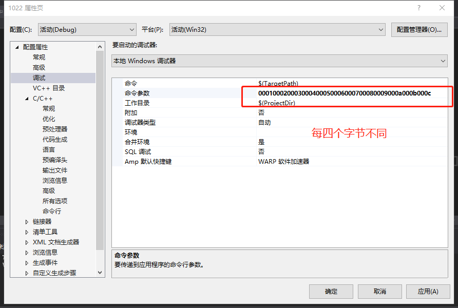

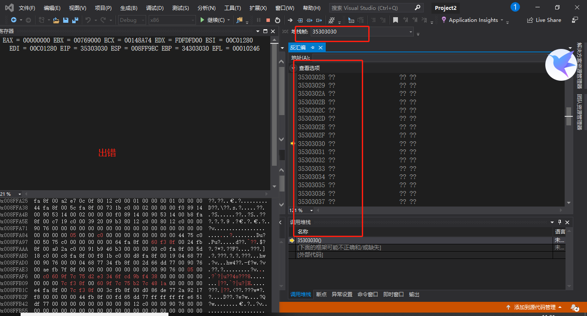

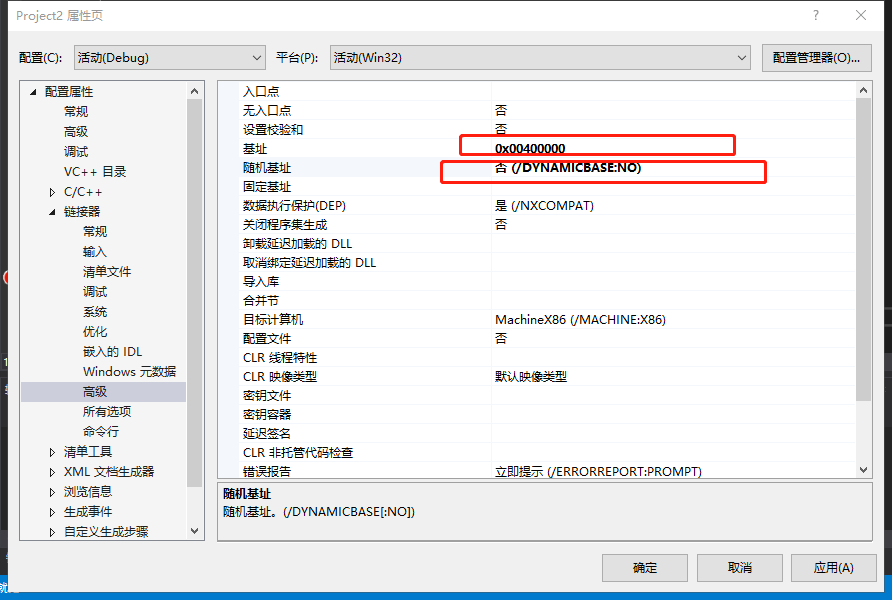

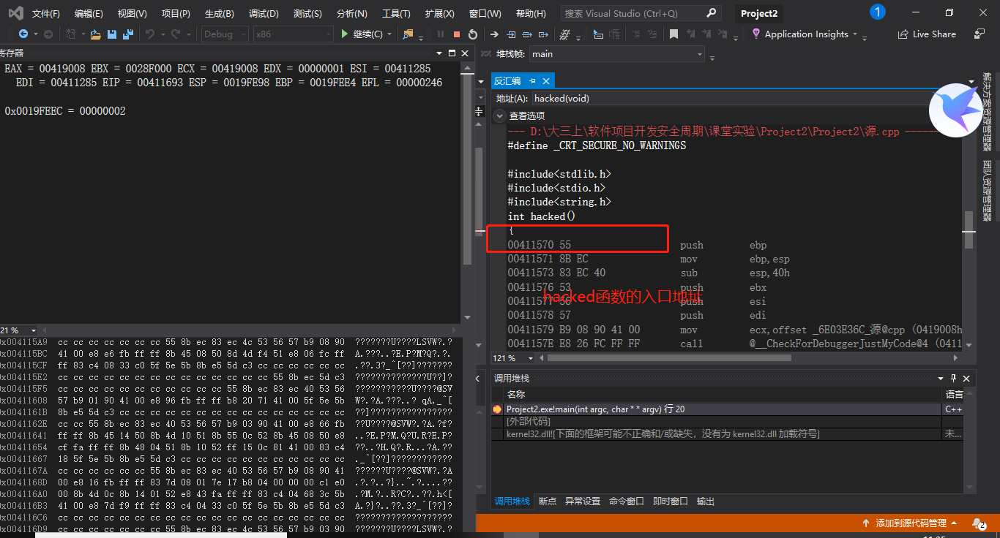

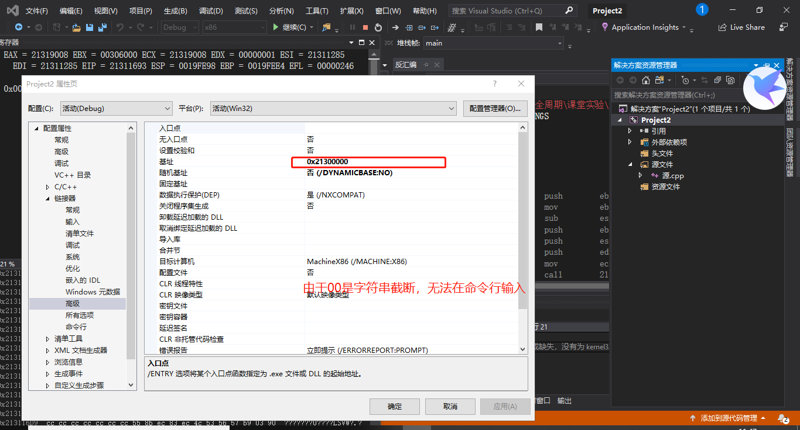

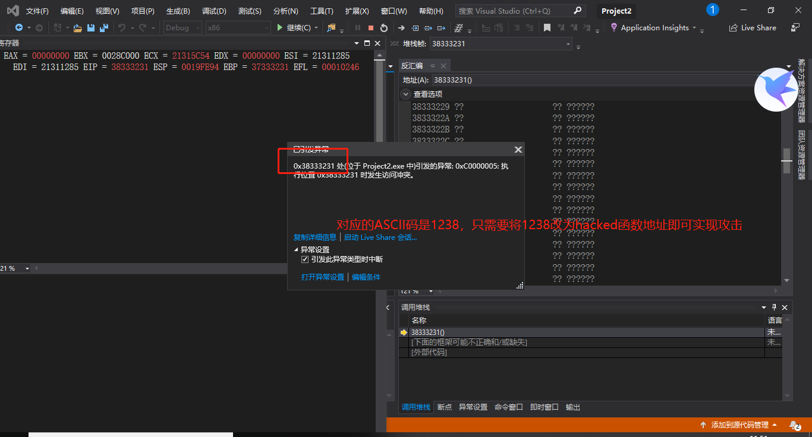

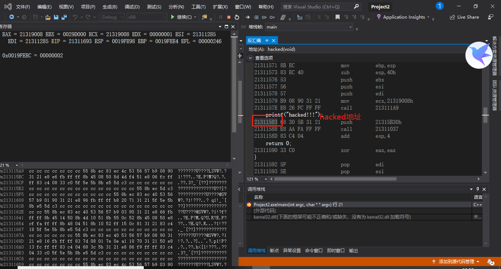

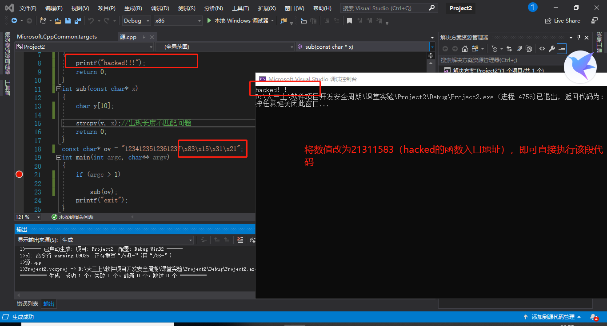

---

## 软件安全和漏洞挖掘基础能力

+ [课本](./软件安全和漏洞挖掘基础能力.md)
+ windbg使用：exe-->API-->Textout(GDI--->控件)
+ [createthread MSDN]( https://docs.microsoft.com/en-us/windows/win32/api/processthreadsapi/nf-processthreadsapi-createthread )  创建线程
+ createprocess  创建进程

### createthread，线程管理

+ main为主线程

+ 代码

  ```c++
  HANDLE CreateThread(
    LPSECURITY_ATTRIBUTES   lpThreadAttributes,
    SIZE_T                  dwStackSize,
    LPTHREAD_START_ROUTINE  lpStartAddress, //函数指针，函数名称要赋值给它
    __drv_aliasesMem LPVOID lpParameter,//参数
    DWORD                   dwCreationFlags,
    LPDWORD                 lpThreadId
  );
  ```

+ createthread 例子

  ```c++
  #include <windows.h>
  #include <tchar.h>
  #include <strsafe.h>
  
  #define MAX_THREADS 3
  #define BUF_SIZE 255
  
  DWORD WINAPI MyThreadFunction( LPVOID lpParam );
  void ErrorHandler(LPTSTR lpszFunction);
  
  // Sample custom data structure for threads to use.
  // This is passed by void pointer so it can be any data type
  // that can be passed using a single void pointer (LPVOID).
  typedef struct MyData {
      int val1;
      int val2;
  } MYDATA, *PMYDATA;
  
  
  int _tmain()
  {
      PMYDATA pDataArray[MAX_THREADS];
      DWORD   dwThreadIdArray[MAX_THREADS];
      HANDLE  hThreadArray[MAX_THREADS]; 
  
      // Create MAX_THREADS worker threads.
  
      for( int i=0; i<MAX_THREADS; i++ )
      {
          // Allocate memory for thread data.
  
          pDataArray[i] = (PMYDATA) HeapAlloc(GetProcessHeap(), HEAP_ZERO_MEMORY,
                  sizeof(MYDATA));
  
          if( pDataArray[i] == NULL )
          {
             // If the array allocation fails, the system is out of memory
             // so there is no point in trying to print an error message.
             // Just terminate execution.
              ExitProcess(2);
          }
  
          // Generate unique data for each thread to work with.
  
          pDataArray[i]->val1 = i;
          pDataArray[i]->val2 = i+100;
  
          // Create the thread to begin execution on its own.
  
          hThreadArray[i] = CreateThread( 
              NULL,                   // default security attributes
              0,                      // use default stack size  
              MyThreadFunction,       // thread function name
              pDataArray[i],          // argument to thread function 
              0,                      // use default creation flags 
              &dwThreadIdArray[i]);   // returns the thread identifier 
  
  
          // Check the return value for success.
          // If CreateThread fails, terminate execution. 
          // This will automatically clean up threads and memory. 
  
          if (hThreadArray[i] == NULL) 
          {
             ErrorHandler(TEXT("CreateThread"));
             ExitProcess(3);
          }
      } // End of main thread creation loop.
  
      // Wait until all threads have terminated.
  
      WaitForMultipleObjects(MAX_THREADS, hThreadArray, TRUE, INFINITE);
  
      // Close all thread handles and free memory allocations.
  
      for(int i=0; i<MAX_THREADS; i++)
      {
          CloseHandle(hThreadArray[i]);
          if(pDataArray[i] != NULL)
          {
              HeapFree(GetProcessHeap(), 0, pDataArray[i]);
              pDataArray[i] = NULL;    // Ensure address is not reused.
          }
      }
  
      return 0;
  }
  
  
  DWORD WINAPI MyThreadFunction( LPVOID lpParam ) //等价printf
  { 
      HANDLE hStdout;//处理错误
      PMYDATA pDataArray;
  
      TCHAR msgBuf[BUF_SIZE];
      size_t cchStringSize;
      DWORD dwChars;
  
      // Make sure there is a console to receive output results. 
  
      hStdout = GetStdHandle(STD_OUTPUT_HANDLE);
      if( hStdout == INVALID_HANDLE_VALUE )
          return 1;
  
      // Cast the parameter to the correct data type.
      // The pointer is known to be valid because 
      // it was checked for NULL before the thread was created.
   
      pDataArray = (PMYDATA)lpParam;
  
      // Print the parameter values using thread-safe functions.
  
      StringCchPrintf(msgBuf, BUF_SIZE, TEXT("Parameters = %d, %d\n"), 
          pDataArray->val1, pDataArray->val2); 
      StringCchLength(msgBuf, BUF_SIZE, &cchStringSize);
      WriteConsole(hStdout, msgBuf, (DWORD)cchStringSize, &dwChars, NULL);//向控制台写入数据
  
      return 0; 
  } 
  
  
  
  void ErrorHandler(LPTSTR lpszFunction) 
  { 
      // Retrieve the system error message for the last-error code.
  
      LPVOID lpMsgBuf;
      LPVOID lpDisplayBuf;
      DWORD dw = GetLastError(); 
  
      FormatMessage(
          FORMAT_MESSAGE_ALLOCATE_BUFFER | 
          FORMAT_MESSAGE_FROM_SYSTEM |
          FORMAT_MESSAGE_IGNORE_INSERTS,
          NULL,
          dw,
          MAKELANGID(LANG_NEUTRAL, SUBLANG_DEFAULT),
          (LPTSTR) &lpMsgBuf,
          0, NULL );
  
      // Display the error message.
  
      lpDisplayBuf = (LPVOID)LocalAlloc(LMEM_ZEROINIT, 
          (lstrlen((LPCTSTR) lpMsgBuf) + lstrlen((LPCTSTR) lpszFunction) + 40) * sizeof(TCHAR)); 
      StringCchPrintf((LPTSTR)lpDisplayBuf, 
          LocalSize(lpDisplayBuf) / sizeof(TCHAR),
          TEXT("%s failed with error %d: %s"), 
          lpszFunction, dw, lpMsgBuf); 
      MessageBox(NULL, (LPCTSTR) lpDisplayBuf, TEXT("Error"), MB_OK); 
  
      // Free error-handling buffer allocations.
  
      LocalFree(lpMsgBuf);
      LocalFree(lpDisplayBuf);
  }
  ```

+ 出现const char *和LPTSTR不兼容，修改属性

  在项目属性->C/C++->语言中的符合模式项选择否即可~

+ 为了便于阅读，将mythredfunction修改如下

  ```c++
  
  DWORD WINAPI MyThreadFunction(LPVOID lpParam) //等价printf
  {
  	/*HANDLE hStdout;*///处理错误
  	PMYDATA pDataArray;
  
  	//TCHAR msgBuf[BUF_SIZE];
  	//size_t cchStringSize;
  	//DWORD dwChars;
  
  	//// Make sure there is a console to receive output results. 
  
  	//hStdout = GetStdHandle(STD_OUTPUT_HANDLE);
  	//if (hStdout == INVALID_HANDLE_VALUE)
  		/*return 1;*/
  
  	// Cast the parameter to the correct data type.
  	// The pointer is known to be valid because 
  	// it was checked for NULL before the thread was created.
  
  	pDataArray = (PMYDATA)lpParam;
  
  	// Print the parameter values using thread-safe functions.
  	printf("Parameters = %d, %d\n", pDataArray->val1, pDataArray->val2);
  	//StringCchPrintf(msgBuf, BUF_SIZE, TEXT("Parameters = %d, %d\n"),
  	//	pDataArray->val1, pDataArray->val2);
  	//StringCchLength(msgBuf, BUF_SIZE, &cchStringSize);
  	//WriteConsole(hStdout, msgBuf, (DWORD)cchStringSize, &dwChars, NULL);//向控制台写入数据
  
  	return 0;
  }
  ```

+ 将main函数中这一段改掉

  ```c++
        if (hThreadArray[i] == NULL)
  		{
  			printf("CreateThread Eroor(%d)", GetLastError());
  			/*ErrorHandler(TEXT("CreateThread"));*/
  			ExitProcess(3);
  		}
  ```

+ 修改

  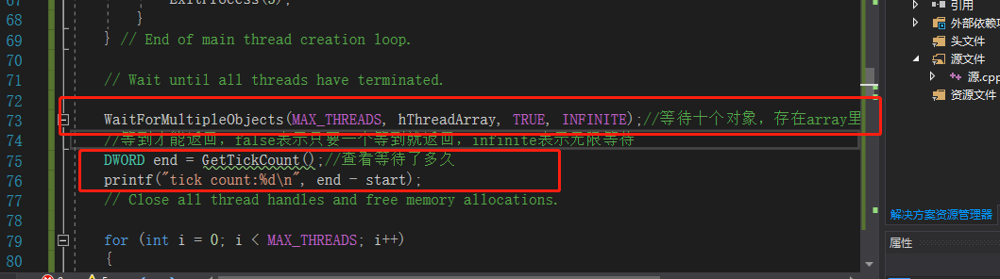

  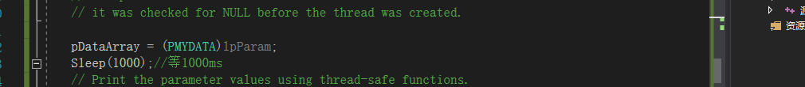

  

+ 注释完几段代码后即可从多线程变为单线程

  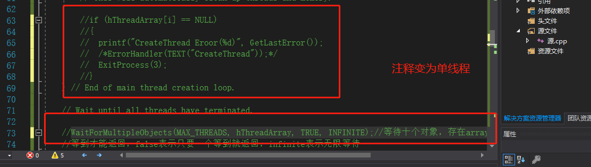


### [createprocess]( https://docs.microsoft.com/en-us/windows/win32/api/processthreadsapi/nf-processthreadsapi-createprocessa )

+ 代码

  ```c++
  #include <windows.h>
  #include <stdio.h>
  #include <tchar.h>
  
  void _tmain( int argc, TCHAR *argv[] )
  {
      STARTUPINFO si;
      PROCESS_INFORMATION pi;
  
      ZeroMemory( &si, sizeof(si) );
      si.cb = sizeof(si);
      ZeroMemory( &pi, sizeof(pi) );
  
      if( argc != 2 )
      {
          printf("Usage: %s [cmdline]\n", argv[0]);
          return;
      }
  
      // Start the child process. 
      if( !CreateProcess( NULL,   // No module name (use command line)
          argv[1],        // Command line
          NULL,           // Process handle not inheritable
          NULL,           // Thread handle not inheritable
          FALSE,          // Set handle inheritance to FALSE
          0,              // No creation flags
          NULL,           // Use parent's environment block
          NULL,           // Use parent's starting directory 
          &si,            // Pointer to STARTUPINFO structure
          &pi )           // Pointer to PROCESS_INFORMATION structure
      ) 
      {
          printf( "CreateProcess failed (%d).\n", GetLastError() );
          return;
      }
  
      // Wait until child process exits.
      WaitForSingleObject( pi.hProcess, INFINITE );
  
      // Close process and thread handles. 
      CloseHandle( pi.hProcess );
      CloseHandle( pi.hThread );
  }
  ```

+ 编译通过

+ cmd进到exe目录

  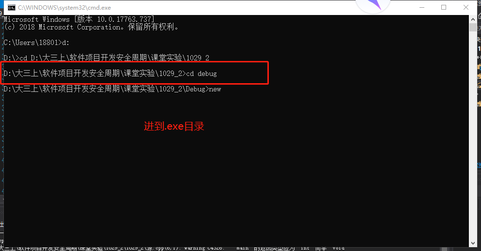

+ 创建进程,用前一个进程创建第二个进程

  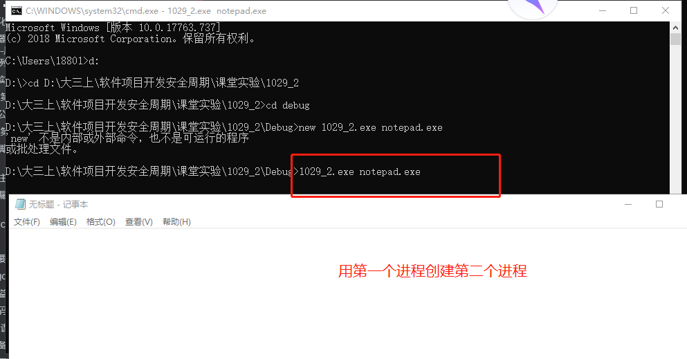

  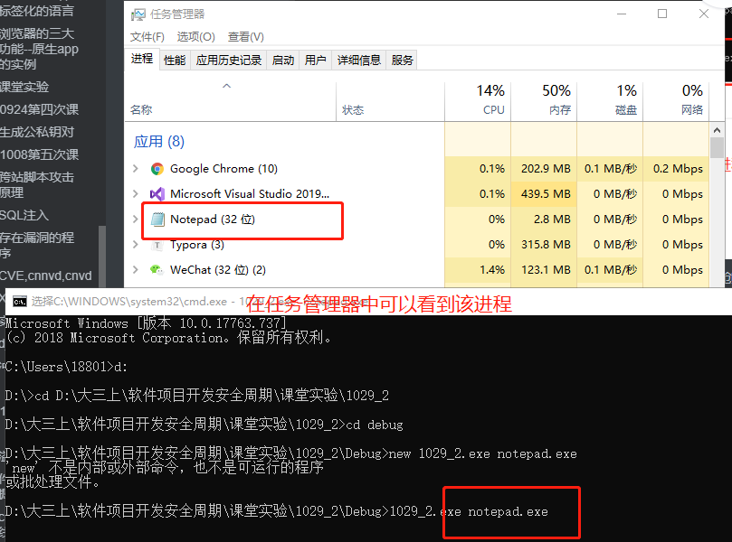

+ 操作系统创建进程都要调用createprocess，a进程调用createprocess创建了b进程，则a进程即为b进程的父进程

+ 下载[process explore]( https://docs.microsoft.com/en-us/sysinternals/downloads/process-explorer )可以查看进程列表及父子关系

+ 一旦子进程结束了，父进程也就结束退出了

  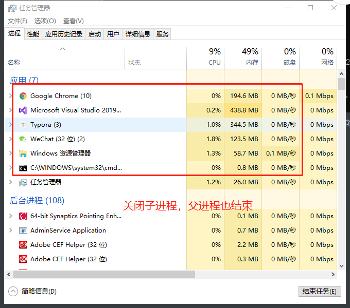


