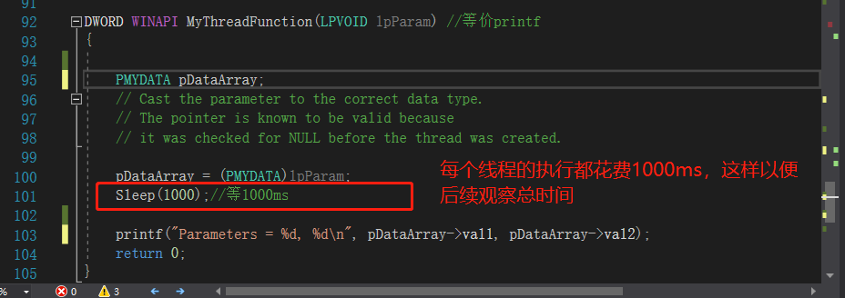
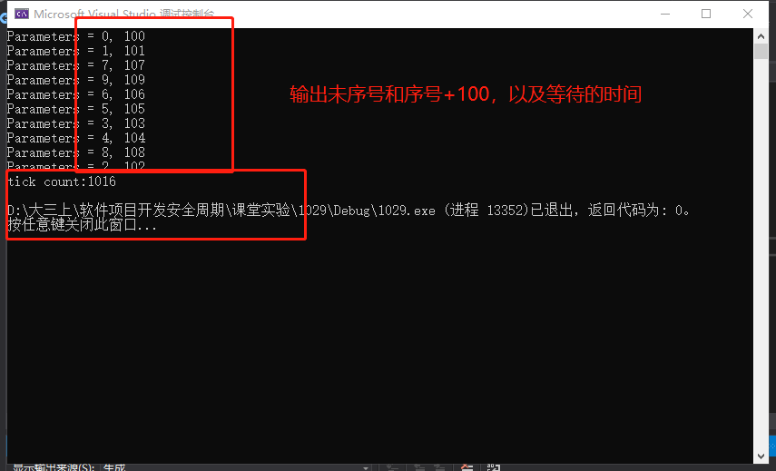
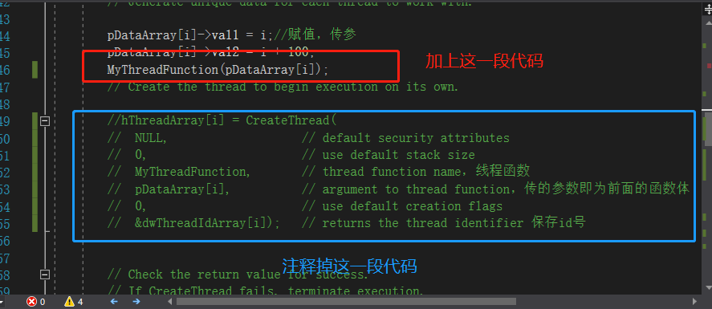
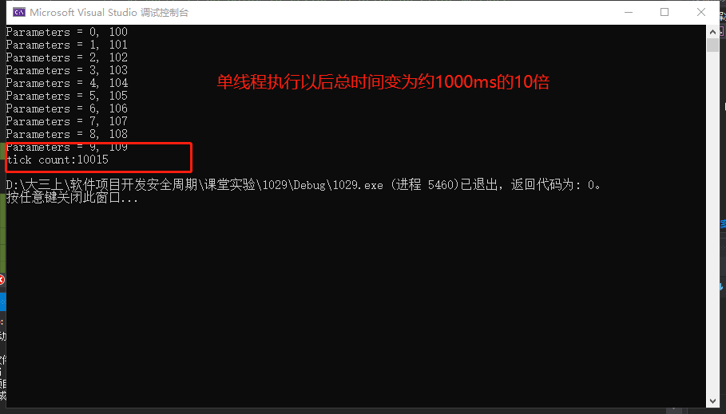
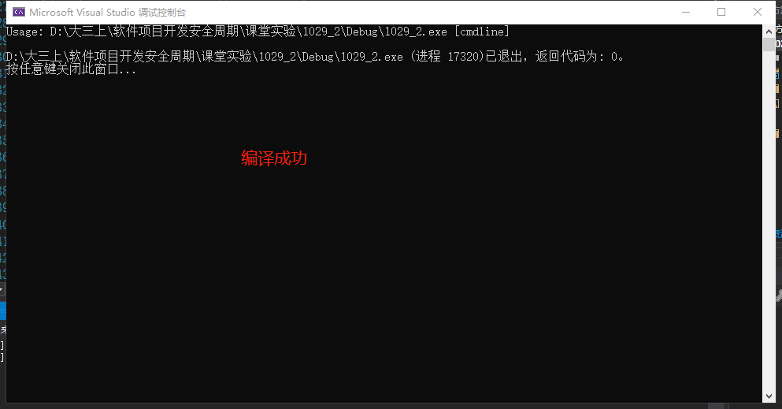
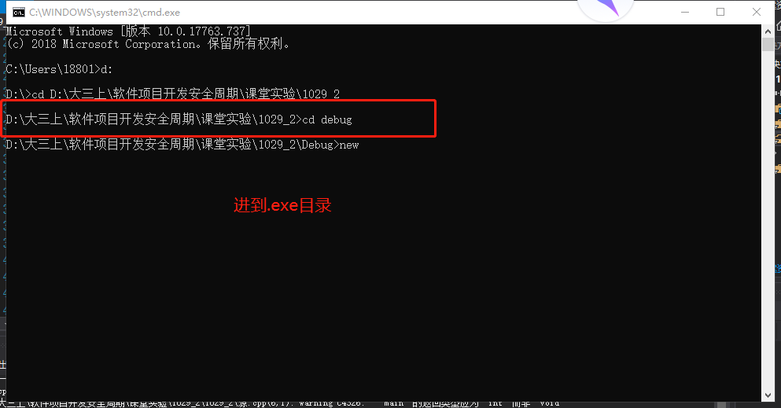
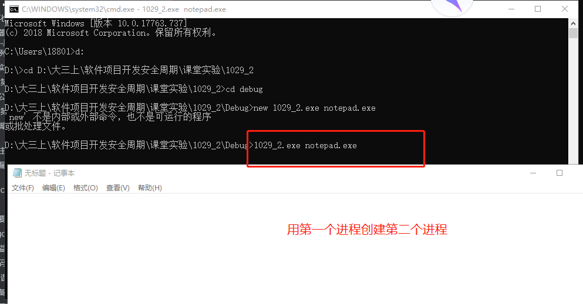
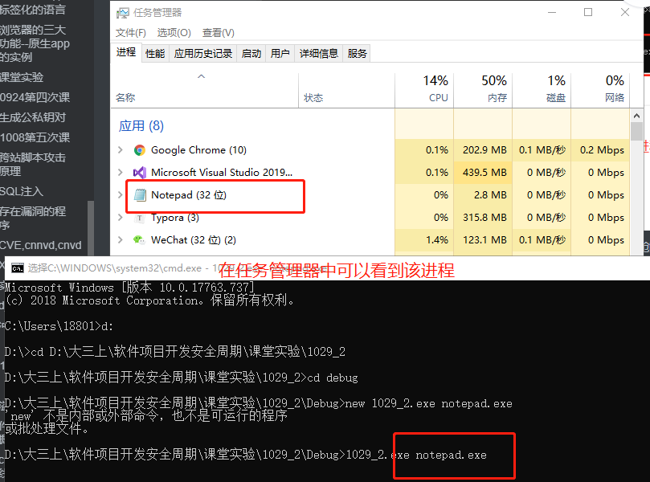
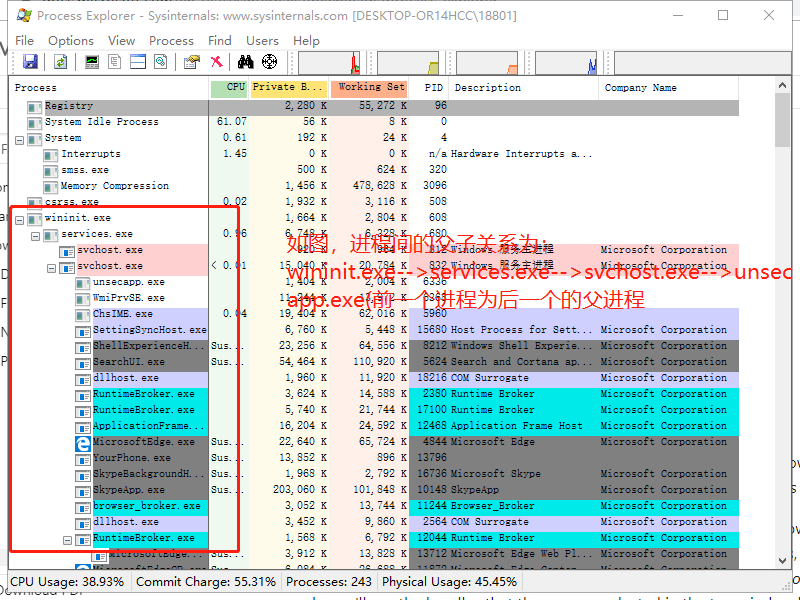

# 线程与进程的创建与管理

## 实验目的

+ 通过底层代码的执行与调试体会操作系统创建和管理进程和线程原理

## 实验先修知识

+ 线程、多线程和线程同步
+ Windows下使用CreateThread创建线程
+ Linux下使用pthread创建线程
+ 线程的并发执行原理
+ 使用SuspendThread、ResumeThread API启动和停止线程
+ Windows下主线程等待子线程结束（WaitForSingleObject、WaitForMultipleObjects）
+ 使用事件（Event）、互斥量（Mutex）进行线程同步。

## 实验过程

### createthread，线程管理

+ main为主线程

+ 创建线程代码

  ```c++
  HANDLE CreateThread(
    LPSECURITY_ATTRIBUTES   lpThreadAttributes,
    SIZE_T                  dwStackSize,
    LPTHREAD_START_ROUTINE  lpStartAddress, //函数指针，函数名称要赋值给它
    __drv_aliasesMem LPVOID lpParameter,//参数
    DWORD                   dwCreationFlags,
    LPDWORD                 lpThreadId
  );
  ```

+ createthread 例子

  ```c++
  #include <windows.h>
  #include <tchar.h>
  #include <strsafe.h>
  
  #define MAX_THREADS 10
  #define BUF_SIZE 255
  
  DWORD WINAPI MyThreadFunction( LPVOID lpParam );
  void ErrorHandler(LPTSTR lpszFunction);
  
  // Sample custom data structure for threads to use.
  // This is passed by void pointer so it can be any data type
  // that can be passed using a single void pointer (LPVOID).
  typedef struct MyData {
      int val1;
      int val2;
  } MYDATA, *PMYDATA;
  
  
  int _tmain()
  {
      PMYDATA pDataArray[MAX_THREADS];
      DWORD   dwThreadIdArray[MAX_THREADS];
      HANDLE  hThreadArray[MAX_THREADS]; 
  
      // Create MAX_THREADS worker threads.
  
      for( int i=0; i<MAX_THREADS; i++ )
      {
          // Allocate memory for thread data.
  
          pDataArray[i] = (PMYDATA) HeapAlloc(GetProcessHeap(), HEAP_ZERO_MEMORY,
                  sizeof(MYDATA));
  
          if( pDataArray[i] == NULL )
          {
             // If the array allocation fails, the system is out of memory
             // so there is no point in trying to print an error message.
             // Just terminate execution.
              ExitProcess(2);
          }
  
          // Generate unique data for each thread to work with.
  
          pDataArray[i]->val1 = i;
          pDataArray[i]->val2 = i+100;
  
          // Create the thread to begin execution on its own.
  
          hThreadArray[i] = CreateThread( 
              NULL,                   // default security attributes
              0,                      // use default stack size  
              MyThreadFunction,       // thread function name
              pDataArray[i],          // argument to thread function 
              0,                      // use default creation flags 
              &dwThreadIdArray[i]);   // returns the thread identifier 
  
  
          // Check the return value for success.
          // If CreateThread fails, terminate execution. 
          // This will automatically clean up threads and memory. 
  
          if (hThreadArray[i] == NULL) 
          {
             ErrorHandler(TEXT("CreateThread"));
             ExitProcess(3);
          }
      } // End of main thread creation loop.
  
      // Wait until all threads have terminated.
  
      WaitForMultipleObjects(MAX_THREADS, hThreadArray, TRUE, INFINITE);
      DWORD end = GetTickCount();//查看等待了多久
  	printf("tick count:%d\n", end - start);
      // Close all thread handles and free memory allocations.
  
      for(int i=0; i<MAX_THREADS; i++)
      {
          CloseHandle(hThreadArray[i]);
          if(pDataArray[i] != NULL)
          {
              HeapFree(GetProcessHeap(), 0, pDataArray[i]);
              pDataArray[i] = NULL;    // Ensure address is not reused.
          }
      }
  
      return 0;
  }
  
  
  DWORD WINAPI MyThreadFunction( LPVOID lpParam ) //等价printf
  { 
      HANDLE hStdout;//处理错误
      PMYDATA pDataArray;
  
      TCHAR msgBuf[BUF_SIZE];
      size_t cchStringSize;
      DWORD dwChars;
  
      // Make sure there is a console to receive output results. 
  
      hStdout = GetStdHandle(STD_OUTPUT_HANDLE);
      if( hStdout == INVALID_HANDLE_VALUE )
          return 1;
  
      // Cast the parameter to the correct data type.
      // The pointer is known to be valid because 
      // it was checked for NULL before the thread was created.
   
      pDataArray = (PMYDATA)lpParam;
      Sleep(1000);//等1000ms
      // Print the parameter values using thread-safe functions.
  
      StringCchPrintf(msgBuf, BUF_SIZE, TEXT("Parameters = %d, %d\n"), 
          pDataArray->val1, pDataArray->val2); 
      StringCchLength(msgBuf, BUF_SIZE, &cchStringSize);
      WriteConsole(hStdout, msgBuf, (DWORD)cchStringSize, &dwChars, NULL);//向控制台写入数据
  
      return 0; 
  } 
  
  
  
  void ErrorHandler(LPTSTR lpszFunction) 
  { 
      // Retrieve the system error message for the last-error code.
  
      LPVOID lpMsgBuf;
      LPVOID lpDisplayBuf;
      DWORD dw = GetLastError(); 
  
      FormatMessage(
          FORMAT_MESSAGE_ALLOCATE_BUFFER | 
          FORMAT_MESSAGE_FROM_SYSTEM |
          FORMAT_MESSAGE_IGNORE_INSERTS,
          NULL,
          dw,
          MAKELANGID(LANG_NEUTRAL, SUBLANG_DEFAULT),
          (LPTSTR) &lpMsgBuf,
          0, NULL );
  
      // Display the error message.
  
      lpDisplayBuf = (LPVOID)LocalAlloc(LMEM_ZEROINIT, 
          (lstrlen((LPCTSTR) lpMsgBuf) + lstrlen((LPCTSTR) lpszFunction) + 40) * sizeof(TCHAR)); 
      StringCchPrintf((LPTSTR)lpDisplayBuf, 
          LocalSize(lpDisplayBuf) / sizeof(TCHAR),
          TEXT("%s failed with error %d: %s"), 
          lpszFunction, dw, lpMsgBuf); 
      MessageBox(NULL, (LPCTSTR) lpDisplayBuf, TEXT("Error"), MB_OK); 
  
      // Free error-handling buffer allocations.
  
      LocalFree(lpMsgBuf);
      LocalFree(lpDisplayBuf);
  }
  ```
  
+ 运行代码，编译未通过，出现const char *和LPTSTR不兼容，修改属性即可，这是由于编码方式的不同所导致

  在项目属性->C/C++->语言中的符合模式项选择否即可~

+ 为了便于理解，去除不必要的代码段，将mythredfunction修改如下

  ```c++
  
  DWORD WINAPI MyThreadFunction(LPVOID lpParam) //等价printf
  {
  	/*HANDLE hStdout;*///处理错误
  	PMYDATA pDataArray;
  
  	//TCHAR msgBuf[BUF_SIZE];
  	//size_t cchStringSize;
  	//DWORD dwChars;
  
  	//// Make sure there is a console to receive output results. 
  
  	//hStdout = GetStdHandle(STD_OUTPUT_HANDLE);
  	//if (hStdout == INVALID_HANDLE_VALUE)
  		/*return 1;*/
  
  	// Cast the parameter to the correct data type.
  	// The pointer is known to be valid because 
  	// it was checked for NULL before the thread was created.
  
  	pDataArray = (PMYDATA)lpParam;
  
  	// Print the parameter values using thread-safe functions.
  	printf("Parameters = %d, %d\n", pDataArray->val1, pDataArray->val2);
  	//StringCchPrintf(msgBuf, BUF_SIZE, TEXT("Parameters = %d, %d\n"),
  	//	pDataArray->val1, pDataArray->val2);
  	//StringCchLength(msgBuf, BUF_SIZE, &cchStringSize);
  	//WriteConsole(hStdout, msgBuf, (DWORD)cchStringSize, &dwChars, NULL);//向控制台写入数据
  
  	return 0;
  }
  ```

+ 将main函数中这一段错误处理改掉

  ```c++
        if (hThreadArray[i] == NULL)
  		{
  			printf("CreateThread Eroor(%d)", GetLastError());
  			/*ErrorHandler(TEXT("CreateThread"));*///去掉错误处理，一般不太会出错
  			ExitProcess(3);
  		}
  ```

+ 最终实现了多线程创建简洁代码如下

  ```c++
  #include <windows.h>
  #include <tchar.h>
  #include <strsafe.h>
  
  #define MAX_THREADS 10
  #define BUF_SIZE 255
  
  DWORD WINAPI MyThreadFunction(LPVOID lpParam);
  
  // Sample custom data structure for threads to use.
  // This is passed by void pointer so it can be any data type
  // that can be passed using a single void pointer (LPVOID).
  typedef struct MyData {
  	int val1;
  	int val2;
  } MYDATA, * PMYDATA;
  
  
  int _tmain()//主函数，参数可以为unicode字符串
  {
  	PMYDATA pDataArray[MAX_THREADS];
  	DWORD   dwThreadIdArray[MAX_THREADS];
  	HANDLE  hThreadArray[MAX_THREADS];
  	DWORD start = GetTickCount();//查看等待了多久
  	// Create MAX_THREADS worker threads.
  
  	for (int i = 0; i < MAX_THREADS; i++)
  	{
  		// Allocate memory for thread data.
  
  		pDataArray[i] = (PMYDATA)HeapAlloc(GetProcessHeap(), HEAP_ZERO_MEMORY,
  			sizeof(MYDATA));
  
  		if (pDataArray[i] == NULL)
  		{
  			// If the array allocation fails, the system is out of memory
  			// so there is no point in trying to print an error message.
  			// Just terminate execution.
  			ExitProcess(2);
  		}
  
  		// Generate unique data for each thread to work with.
  
  		pDataArray[i]->val1 = i;//赋值，传参
  		pDataArray[i]->val2 = i + 100;
  
  		// Create the thread to begin execution on its own.
  
  		hThreadArray[i] = CreateThread(
  			NULL,                   // default security attributes
  			0,                      // use default stack size  
  			MyThreadFunction,       // thread function name
  			pDataArray[i],          // argument to thread function，传的参数即为前面的函数体 
  			0,                      // use default creation flags 
  			&dwThreadIdArray[i]);   // returns the thread identifier 保存id号
  
  
  		// Check the return value for success.
  		// If CreateThread fails, terminate execution. 
  		// This will automatically clean up threads and memory. 
  
  		if (hThreadArray[i] == NULL)
  		{
  			printf("CreateThread Eroor(%d)", GetLastError());
  			
  			ExitProcess(3);
  		}
  	} // End of main thread creation loop.
  
  	// Wait until all threads have terminated.
  	
  	WaitForMultipleObjects(MAX_THREADS, hThreadArray, TRUE, INFINITE);//等待十个对象，存在array里，十个都
  	//等到才能返回，false表示只要一个等到就返回，infinite表示无限等待
  	DWORD end = GetTickCount();//查看等待了多久
  	printf("tick count:%d\n", end - start);
  	// Close all thread handles and free memory allocations.
  
  	for (int i = 0; i < MAX_THREADS; i++)
  	{
  		CloseHandle(hThreadArray[i]);
  		if (pDataArray[i] != NULL)
  		{
  			HeapFree(GetProcessHeap(), 0, pDataArray[i]);
  			pDataArray[i] = NULL;    // Ensure address is not reused.
  		}
  	}
  
  	return 0;
  }
  
  DWORD WINAPI MyThreadFunction(LPVOID lpParam) //等价printf
  {
  
  	PMYDATA pDataArray;
  	// Cast the parameter to the correct data type.
  	// The pointer is known to be valid because 
  	// it was checked for NULL before the thread was created.
  
  	pDataArray = (PMYDATA)lpParam;
  	Sleep(1000);//等1000ms
  	
  	printf("Parameters = %d, %d\n", pDataArray->val1, pDataArray->val2);
  	
  
  	return 0;
  }
  ```
  
+ 将每个线程的创建时间设置为1000ms,创建十个线程，单步执行发现确实创建了十个进程

  
  
+ 通过vs编译成功后执行结果如下，输出分别为我们赋值的序号以及总的执行时间，我们发现使用createthread函数是多线程执行，因此这十个线程是并发执行的，最终的时间仅为一个线程所需要的时间

  
  
+ 接着将代码做以下修改，注释一些代码，变为单线程运行

  

  

+ 删掉createthread函数后从多线程变为单线程执行，时间变为原来时间的10倍

  


---

### createprocess，进程管理

+ 进程创建代码

  ```c++
  #include <windows.h>
  #include <stdio.h>
  #include <tchar.h>
  
  void _tmain( int argc, TCHAR *argv[] )
  {
      STARTUPINFO si;
      PROCESS_INFORMATION pi;
  
      ZeroMemory( &si, sizeof(si) );
      si.cb = sizeof(si);
      ZeroMemory( &pi, sizeof(pi) );
  
      if( argc != 2 )
      {
          printf("Usage: %s [cmdline]\n", argv[0]);
          return;
      }
  
      // Start the child process. 
      if( !CreateProcess( NULL,   // No module name (use command line)
          argv[1],        // Command line
          NULL,           // Process handle not inheritable
          NULL,           // Thread handle not inheritable
          FALSE,          // Set handle inheritance to FALSE
          0,              // No creation flags
          NULL,           // Use parent's environment block
          NULL,           // Use parent's starting directory 
          &si,            // Pointer to STARTUPINFO structure
          &pi )           // Pointer to PROCESS_INFORMATION structure
      ) 
      {
          printf( "CreateProcess failed (%d).\n", GetLastError() );
          return;
      }
  
      // Wait until child process exits.
      WaitForSingleObject( pi.hProcess, INFINITE );
  
      // Close process and thread handles. 
      CloseHandle( pi.hProcess );
      CloseHandle( pi.hThread );
  }
  ```

+ 在vs中编译成功，接下来进行这个进程的使用，该程序是用来创建别的进程的

  

+ cmd进到exe目录

  

+ 创建进程,用前一个进程创建第二个进程，我们这里创建了记事本的进程

  

+ 我们可以在任务管理器中查看该进程的存在

  

+ 操作系统创建进程都要**调用**createprocess，a进程调用createprocess创建了b进程，则a进程即为b进程的**父进程**

+ 一旦notepad子进程结束了，父进程也就结束退出了，当然，该进程也可以自己调用自己创建


+ 下载[process explore]( https://docs.microsoft.com/en-us/sysinternals/downloads/process-explorer )可以查看进程列表及父子关系，该工具可以很清晰的看到进程间的调用关系即父子关系

  

  

## 实验总结

+ 操作系统创建进程和线程都是通过调用系统函数来实现的
+ 创建进程通过createthread实现，而创建线程通过createprocess实现
+ createthread能实现多线程执行
+ createprocess创建进程存在父子关系，即a进程调用createprocess创建了b进程，则a进程即为b进程的**父进程**


## 实验参考资料

+ [createthread MSDN]( https://docs.microsoft.com/en-us/windows/win32/api/processthreadsapi/nf-processthreadsapi-createthread )  创建线程
+ [createprocess]( https://docs.microsoft.com/en-us/windows/win32/api/processthreadsapi/nf-processthreadsapi-createprocessa )  创建进程


