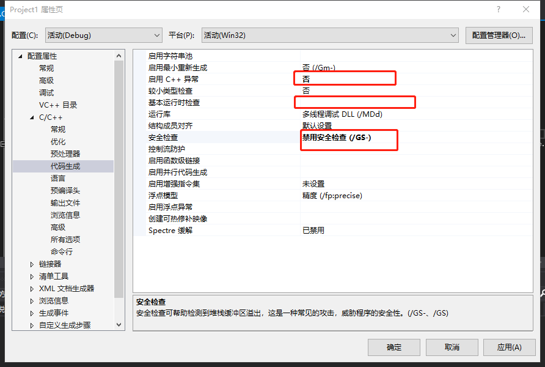

# 缓冲区溢出漏洞实验报告

## 实验目的

+ 从vs编译逐步调试过程感受缓冲区漏洞
+  缓冲区溢出是一种非常普遍、非常危险的漏洞，在各种[操作系统](https://baike.baidu.com/item/操作系统/192)、应用软件中广泛存在。利用[缓冲区溢出攻击](https://baike.baidu.com/item/缓冲区溢出攻击/11056235)，可以导致程序运行失败、系统宕机、重新启动等后果。更为严重的是，可以利用它执行非授权指令，甚至可以取得系统特权，进而进行各种非法操作。 

## 实验环境

+ visual studio2019编译器
+ 主要以c语言为例，作为实验对象

## 实验先修知识

+ （1）ESP：栈指针寄存器(extended stack pointer)，其内存放着一个指针，该指针永远指向系统栈最上面一个栈帧的栈顶。  由于栈的地址大小是从上到下从大到小，所以ESP指在栈的最底端。
+ （2）EBP：基址指针寄存器(extended base pointer)，其内存放着一个指针，该指针永远指向系统栈最上面一个栈帧的底部。指在栈的最顶端。
+   (3) EIP:寄存器里存储的是CPU下次要执行的指令的地址。 
+  (4)  EAX:存放返回值的寄存器。

## 实验代码

```c
#define _CRT_SECURE_NO_WARNINGS

#include<stdlib.h>
#include<stdio.h>
#include<string.h>

int sub(char*x)
{
	char y[10];//变量定义--内存分配，此处分配10个char型的内存大小
	strcpy(y, x);//可能会写入越界，是很大的安全问题
	return 0;
}

int main(int argc, char** argv)//argc是命令行中参数个数（程序本身需要占一个），argv是参数值，是一个字符串类型的数组
{
	if (argc > 1)
		sub(argv[1]);
	printf("exit");
}
```

## 实验过程

+ 在vs中关闭所有安全检查（关闭c++异常检查、基本运行时检查、禁用安全检查），只有关闭了这些检查才能看到最底层出的错误,SDL检查，命令参数加上一串参数（这是cmd命令行里输入的参数）

  

  

  

+ 开始调试，调试过程打开内存，反汇编以及寄存器，以便观察

  

+ push过程：压栈，栈顶指针会减

  
  
+ call指令:除了调用函数跳转到该函数的地址以外，还要把下一条指令的地址入栈，使函数调用完成后回到主函数
  
  
  
+ 为局部变量预留空间
  
  
  
+ 一步步正常执行，按照以上几个规则执行，各个栈指针也在变化。

+ 出错步骤：该地址不存在，此时我们的输入数据是999999999999，倘若改为一些有效的地址，黑客可以进行攻击，程序控制流程被修改，例如：发一个word文件，中了一个木马.也就是缓冲区漏洞的存在。
  
  
  
+ 补充实验

+ malloc/free函数，在程序的执行过程中可以多次malloc,且多次不定时free

+ 堆是一个双向链表，删除一个节点：将后项节点的前项指针指向前项节点，前项节点的后项指针指向后项节点，即将前项节点的数据写入后项节点，若被覆盖，则会向任意节点写入任意数据

+ 这是一个漏洞，因为可以向任意节点写入任意数据（free从链表中的该段数据脱链）

+ 代码示例（栈溢出）

  ```c
  #define _CRT_SECURE_NO_WARNINGS
  
  #include<stdlib.h>
  #include<stdio.h>
  #include<string.h>
  int hacked()
  {
  	printf("hacked!!!");
  	return 0;
  }
  int sub(const char* x)
  {
  	char y[10];
  	
  	strcpy(y, x);//出现长度不匹配问题
  	return 0;
  }
  const char* ov = "123412351236123712381239123a123b123c";
  int main(int argc, char** argv)
  {
  	if (argc > 1)
  	
  		sub(ov);
  	printf("exit");
  }
  ```

  


## 实验总结

+ 入栈过程：
  + argc[1]入栈（**参数**）-->main call下一条地址入栈(**返回地址**）-->ebp(旧)入栈（**caller栈基址**）-->epb-4ch（为函数的**局部变量**分配空间）-->x入栈-->y入栈-->sub--strcpy下一条指令
+ 以上四个加粗部分统称为栈帧
+ ebp是用来定位局部变量的，是栈帧基址指针
+ strcpy正常执行，栈没被破坏，sub函数的栈帧被破坏了，因此回不到主调函数了

